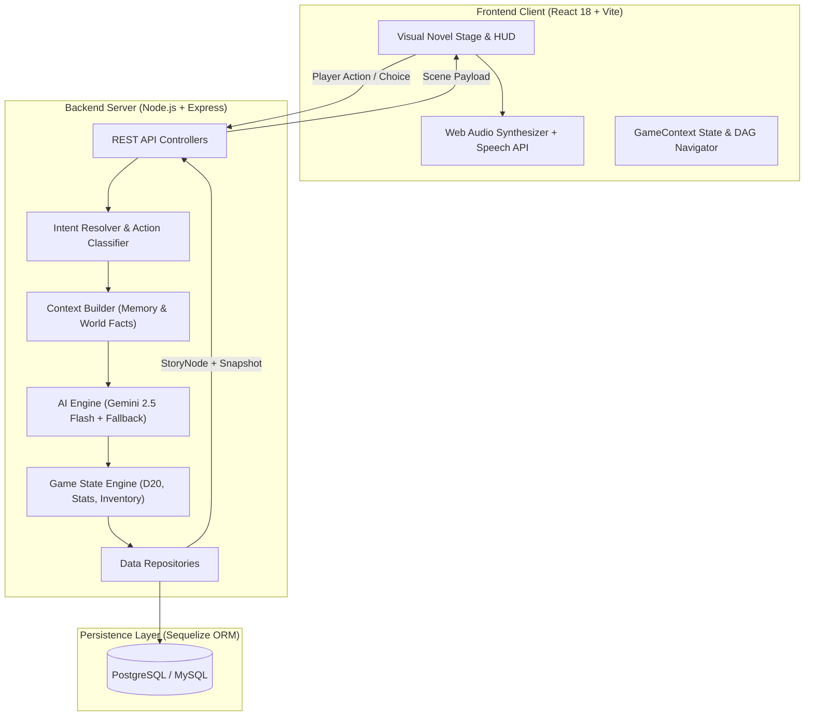
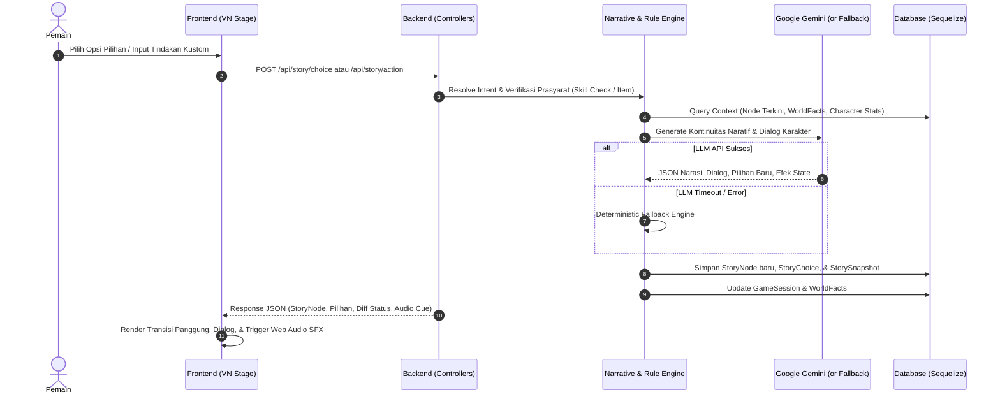

# 🏛️ AetherMaster AI — System Architecture

Dokumen ini mendeskripsikan arsitektur sistem, runtime flow, skema basis data, subsistem audio, dan protokol penyimpanan pada platform **AetherMaster AI**.

---

## 1. System Architecture Diagram



---

## 2. Runtime Flow

Siklus eksekusi giliran narasi (*turn-based narrative cycle*) berjalan melalui tahapan berikut:



---

## 3. Database Schema Ringkas

Model data menggunakan **Sequelize ORM** yang mendukung PostgreSQL (Cloud: Supabase/Neon/Render) dan MySQL (Lokal):

| Model | Deskripsi & Atribut Kunci | Relasi Utama |
| :--- | :--- | :--- |
| **`Campaign`** | Katalog skenario dan modul petualangan (`id`, `title`, `description`, `genre`, `difficulty`, `status`). | HasMany: `Location`, `NPC`, `Quest`, `GameSession` |
| **`Character`** | Karakter pemain dengan stat RPG (`name`, `characterClass`, `level`, `hp`, `maxHp`, `mana`, `gold`, `stats` [STR, DEX, CON, INT, WIS, CHA], `inventory`). | HasMany: `GameSession` |
| **`GameSession`** | Sesi bermain aktif (`sessionId`, `campaignId`, `characterId`, `currentNodeId`, `questState`, `turnCount`, `status`). | BelongsTo: `Campaign`, `Character`; HasMany: `StoryNode`, `WorldFact` |
| **`StoryNode`** | Simpul adegan dalam grafik terarah (*DAG*) (`id`, `sessionId`, `parentNodeId`, `narrativeText`, `dialogue`, `speakerId`, `locationId`, `actNumber`). | BelongsTo: `GameSession`, `StoryNode (parent)`; HasMany: `StoryChoice`; HasOne: `StorySnapshot` |
| **`StoryChoice`** | Opsi pilihan cabang dari suatu simpul (`id`, `storyNodeId`, `label`, `actionType`, `skillCheck`, `dc`, `nextNodeId`). | BelongsTo: `StoryNode` |
| **`StorySnapshot`** | Rekaman status instan untuk fitur *Rewind* (`id`, `storyNodeId`, `hp`, `mana`, `gold`, `inventorySnapshot`, `worldFactSnapshot`). | BelongsTo: `StoryNode` |
| **`WorldFact`** | Memori jangka panjang peristiwa dunia (`sessionId`, `factKey`, `factValue`, `category`, `importance`). | BelongsTo: `GameSession` |
| **`Item`** | Master data benda, senjata, dan artefak (`id`, `name`, `category`, `rarity`, `effectType`, `effectValue`, `metadata`). | Direferensikan via `Character.inventory` |
| **`Location`** | Lokasi latar panggung (`id`, `campaignId`, `name`, `backgroundId`, `locationType`). | BelongsTo: `Campaign`; HasMany: `StoryNode` |
| **`NPC`** | Karakter non-pemain (`id`, `campaignId`, `name`, `title`, `portraitId`, `characterType`). | BelongsTo: `Campaign`; HasMany: `StoryNode` |

---

## 4. Audio Subsystem

Arsitektur audio dirancang secara mandiri dan *zero-bloat*:

1. **Procedural Web Audio API (SFX)**:
   - Dihasilkan secara langsung melalui sintesis gelombang audio browser (*sine, square, triangle, noise buffers*).
   - Efek suara mencakup: *sword clash*, *dice roll impact*, *critical heartbeat pulse*, *magic cast*, dan *UI interaction clicks*.
   - Tidak memerlukan file audio MP3/WAV eksternal untuk sound effect, menghemat bandwidth dan memangkas latency hingga 0ms.
2. **Ambient Soundscapes**:
   - Lapisan generator suasana latar prosedural (Kedai Ramai, Badai Salju Puncak Es, Gua Bawah Laut) berbasis *filtered noise* dan osilator multi-tier.
3. **Voice / Speech Synthesis**:
   - Didukung secara primer melalui Microsoft Edge Neural TTS untuk suara karakter ekspresif dan natural.
   - Fallback otomatis ke peramban native **Web Speech API** apabila koneksi offline atau kuota layanan habis.

---

## 5. Save / Load Protocol

Mekanisme persistensi progres permainan menggunakan arsitektur multi-slot terisolasi:

```
[Slot Index 0]  ---> AUTO SAVE (Diperbarui otomatis pada transisi adegan/pilihan kunci)
[Slot Index 1]  ---> MANUAL SAVE 1 (Dikelola penuh oleh pemain)
[Slot Index 2]  ---> MANUAL SAVE 2 (Dikelola penuh oleh pemain)
[Slot Index 3]  ---> MANUAL SAVE 3 (Dikelola penuh oleh pemain)
```

- **Struktur Payload Save**:
  - `saveSlot`: Indeks slot (0 = Auto, 1–3 = Manual).
  - `timestamp`: Waktu ISO penyimpanan.
  - `characterOverview`: Level, kelas, HP saat ini, kuantitas emas.
  - `scenePreview`: Judul lokasi, kutipan dialog terakhir, nomor babak.
  - `sessionData`: Snapshot lengkap status sesi, inventaris, memori fakta dunia, dan node aktif.
- **Portabilitas (Export / Import)**:
  - Pemain dapat mengekspor seluruh rekaman slot ke berkas JSON terenkripsi/tervalidasi untuk pencadangan (*backup*) atau melanjutkan permainan di perangkat lain.
- **Integrasi Rewind DAG**:
  - Di luar sistem slot, setiap *StoryNode* menyimpan *StorySnapshot*, memungkinkan fitur *Rewind* ke cabang cerita sebelumnya tanpa kehilangan konsistensi data.
