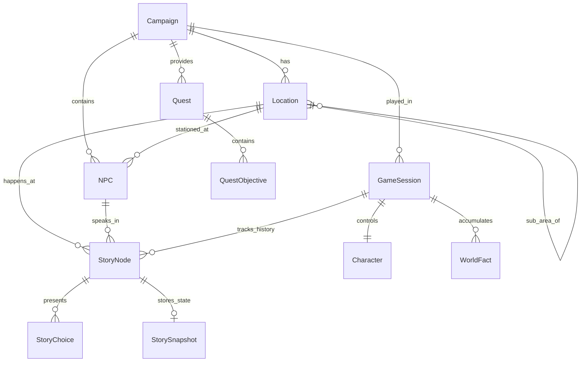

# DATA ARCHITECTURE & UI AUDIT
**Dokumen Audit Arsitektur Data, Sumber Kebenaran, Model Database, dan Analisis UI**
*Tanggal Audit: 2026-09-27 | Scope: Data-Driven Database Refactor & UI Consistency (Combat Out-of-Scope)*

---

## 1. EXECUTIVE SUMMARY & AUDIT FINDINGS

AetherMaster-AI saat ini memiliki fondasi visual dan mekanisme AI narrative yang kaya. Namun, sebagian besar data dunia (Item, NPC, Lokasi, Background, Quest, Reward, dan Fakta Dunia) masih tersebar sebagai struktur *hardcoded* di dalam file JavaScript (`sceneSchema.js`, `fallbackGenerator.js`, `itemMaster.js`, `questEngine.js`, `campaignSeeder.js`, dan frontend maps).

### Sasaran Utama Refaktor:
1. **Database sebagai Satu-satunya Sumber Data Dunia**: Memindahkan seluruh data Item, NPC, Campaign, Location, Quest/Objective, dan World Fact ke tabel database relasional terstruktur.
2. **Game State Engine sebagai Satu-satunya Sumber Kebenaran**: Mengelola kalkulasi inventaris, mutasi status, quest progression, dan histori snapshot.
3. **Gemini / LLM sebagai Narrative Engine Murni**: Menerima konteks dinamis dari database/game state dan menghasilkan narasi tanpa otoritas mengubah data dunia secara liar.
4. **Combat Out of Scope**: Seluruh mekanisme tempur (`combatEngine.js`, `CombatStage.jsx`, formula damage, state combat) **tidak dirombak**.

---

## 2. AUDIT DATA HARDCODED DI SERVER & FRONTEND (PHASE 0)

| Data / Entitas | Lokasi Penyimpanan Saat Ini | Bentuk Saat Ini (Hardcoded vs DB) | Model / Tabel Terkait | Target Penyimpanan Baru | Dependency Yang Harus Diubah | Risiko Migration |
|---|---|---|---|---|---|---|
| **NPC Lookup (`NPC_NAME_LOOKUP`)** | `backend/src/services/narrative/fallbackGenerator.js` | Hardcoded Object Dictionary (18 NPC id & nama) | Tidak ada tabel NPC | Tabel `NPC` | `fallbackGenerator.js`, `promptBuilder.js`, `storyController.js` | Rendah; NPC lama dipetakan ke ID kanonikal |
| **Item Master (`KNOWN_ITEMS` & `ITEM_CATALOG`)** | `backend/src/services/narrative/sceneSchema.js`, `backend/src/engine/itemMaster.js` | Hardcoded JS Object (23 item definisi statis) | Tidak ada tabel Item | Tabel `Item` | `itemMaster.js`, `sceneSchema.js`, `fallbackGenerator.js`, `storyController.js`, `CharacterHUD.jsx` | Rendah; ID item diinventaris karakter harus tetap cocok |
| **`resolveItemById` Helper** | `sceneSchema.js`, `fallbackGenerator.js` | Hardcoded in-memory function | - | `ItemRepository.findById(id)` | `geminiService.js`, `fallbackGenerator.js` | Nol |
| **Campaign Master Data** | `backend/src/models/seeders/campaignSeeder.js` | JS Array (20 campaign) di-seed ke DB | Model `Campaign` | Model `Campaign` (diperluas relasinya ke `Location` dan `NPC`) | `campaignSeeder.js`, `questEngine.js` | Rendah; data campaign sudah ada di DB |
| **Lokasi & Background (`BACKGROUND_MAP`)** | `frontend/src/components/VisualNovelStage.jsx`, `campaignSeeder.js` | Hardcoded Object (29 ID background), teks lokasi arbitrer | Belum ada tabel Location | Tabel `Location` | `VisualNovelStage.jsx`, `storyController.js`, `promptBuilder.js` | Rendah |
| **NPC Portrait Mapping (`PORTRAIT_MAP`)** | `VisualNovelStage.jsx`, `FantasyAvatar.jsx` | Hardcoded Object (18 mapping potret) | Belum ada relasi potret NPC di DB | Field `portraitId` pada tabel `NPC` | `VisualNovelStage.jsx`, `FantasyAvatar.jsx` | Rendah |
| **Quest & Objectives (`CAMPAIGN_OBJECTIVES`)** | `backend/src/engine/questEngine.js` | Hardcoded JS Dictionary | JSON `missionLog` di `GameSession` | Tabel `Quest` dan `QuestObjective` | `questEngine.js`, `storyController.js`, `GameSession` | Rendah; `missionLog` disinkronkan dari tabel Quest |
| **World Facts / Ledger** | `backend/src/engine/worldLedgerService.js`, `GameSession.worldLedger` | JSON Blob arbitrer pada `GameSession` | Kolom JSON `worldLedger` | Tabel `WorldFact` + relasi ke `GameSession` & `StoryNode` | `worldLedgerService.js`, `saveLoadController.js`, `gameStateEngine.js` | Menengah; snapshot tetap menyimpan referensi |
| **Character Creation Starters** | `frontend/src/components/CharacterCreationModal.jsx` | Hardcoded starter item & stats | Model `Character` | Baca item dari endpoint `/api/items` & preset kelas | `CharacterCreationModal.jsx` | Rendah |
| **Story Tree & Choices** | `StoryNode.js` (choices disimpan sebagai JSON array) | Model `StoryNode` (JSON column) | Model `StoryNode` | Tabel `StoryNode` + tabel `StoryChoice` & `StorySnapshot` | `storyController.js`, `saveLoadController.js`, `gameStateEngine.js` | Menengah; pastikan backward compatibility query node |

---

## 3. AUDIT UI EXISTING (PHASE 1)

Audit terhadap seluruh komponen UI yang sudah terpasang di `frontend/src/`:

| Komponen UI | File Komponen | Status Evaluasi | Analisis & Rekomendasi |
|---|---|---|---|
| **Main Game Stage** | `VisualNovelStage.jsx` | **IMPROVE** | Visual dan layout sangat bagus (immersive visual novel). Perlu membersihkan hardcoded `BACKGROUND_MAP` dan `PORTRAIT_MAP` agar mengonsumsi metadata resmi dari backend. |
| **Dialogue & Narration Box** | `VisualNovelStage.jsx` | **KEEP** | Tampilan dialog, penanda speaker, typewriter effect, dan mood badge sudah bekerja sangat baik. |
| **Choices Section** | `VisualNovelStage.jsx` | **KEEP** | Pilihan aksi taktis dengan tone indikator responsif dan mudah ditekan (touch target memadai). |
| **Character HUD** | `CharacterHUD.jsx` | **KEEP** | Bar HP/Mana, avatar, armor class, dan koin emas sudah terhubung ke backend state. |
| **Inventory Drawer / Modal** | `CharacterHUD.jsx`, `ItemSlot.jsx` | **IMPROVE** | Tampilan slot 6 item sudah baik, namun deskripsi item, kategori (consumable vs equipment), dan aksi gunakan item harus membaca detail dari database via backend. |
| **Quest & Mission Display** | `VisualNovelStage.jsx` (Header badge & tooltip) | **REFACTOR** | Saat ini hanya menampilkan `missionLog.objective` ringkas. Perlu panel/modal Quest dedicated yang menampilkan daftar multi-objective, status selesai/aktif, dan target lokasi. |
| **Journal / Lore Modal** | *Belum ada modal terpisah* | **MISSING** | Diperlukan modal Jurnal Petualangan untuk melihat daftar NPC yang telah ditemui, lokasi yang pernah dikunjungi, dan World Facts yang telah terungkap. |
| **Story Tree / Rewind Modal** | `StoryTreeModal.jsx` | **IMPROVE** | Pohon cerita visual sudah tersedia. Perlu memastikan node menampilkan info lokasi, ringkasan snapshot status saat itu, dan tombol rewind memicu pemulihan atomik. |
| **Backlog Dialog Modal** | `BacklogModal.jsx` | **KEEP** | Riwayat dialog sebelumnya ditampilkan rapi dengan filter pencarian dan tombol putar audio TTS. |
| **Save / Load Modal** | `SaveLoadModal.jsx` | **KEEP** | 6 slot penyimpanan (1 auto, 5 manual) dengan snapshot level, HP, lokasi, dan tanggal simpan. |
| **Combat Stage** | `CombatStage.jsx` | **KEEP (FROZEN)** | Sesuai aturan: **COMBAT SEPENUHNYA DI LUAR SCOPE**. Tidak diubah. |
| **Responsive Mobile Layout** | Seluruh Stage | **IMPROVE** | Pada layar < 400px (iPhone SE/Android kecil), pastikan bar aksi bawah dan HUD tidak tumpang tindih. |
| **Empty, Loading & Error States** | Global / Stage | **IMPROVE** | Tambahkan loading state naratif AI (*"Dungeon Master sedang merangkai takdir..."*) dan cegah double-click saat request berlangsung. |

---

## 4. TARGET ARSITEKTUR DATABASE RELASIONAL (PHASE 2)

### Rincian Tabel Baru:
1. **`Campaign`**: `id`, `title`, `premise`, `introDialogue`, `genre`, `threatLevel`, `defaultBackgroundId`, `defaultNpcId`, `icon`, `coverImage`, `factions`.
2. **`Location`**: `id`, `campaignId`, `name`, `description`, `backgroundId`, `parentLocationId`, `locationType`, `metadata`.
3. **`NPC`**: `id`, `campaignId`, `name`, `title`, `description`, `characterType`, `portraitId`, `defaultLocationId`, `personality`, `background`, `isActive`.
4. **`Item`**: `id`, `name`, `description`, `category`, `rarity`, `icon`, `maxStack`, `isConsumable`, `isUsable`, `effectType`, `effectValue`, `metadata`.
5. **`Quest`**: `id`, `campaignId`, `title`, `description`, `type`, `status`, `priority`, `targetLocationId`.
6. **`QuestObjective`**: `id`, `questId`, `description`, `objectiveType`, `targetId`, `requiredCount`, `sequence`, `isOptional`.
7. **`WorldFact`**: `id`, `sessionId`, `campaignId`, `subjectType`, `subjectId`, `factType`, `fact`, `importance`, `sourceNodeId`, `turn`.
8. **`StoryNode`**: `id`, `sessionId`, `parentNodeId`, `campaignId`, `locationId`, `speakerId`, `backgroundId`, `chapterTitle`, `dialogueText`, `consequenceNote`, `mood`, `turnNumber`.
9. **`StoryChoice`**: `id`, `storyNodeId`, `choiceKey`, `text`, `actionType`, `tone`, `requiredItemId`, `sequence`.
10. **`StorySnapshot`**: `id`, `storyNodeId`, `characterState`, `inventoryState`, `questState`, `worldState`, `ledgerState`.

---

## 5. RENCANA EKSEKUSI BERTAHAP (IMPLEMENTATION PHASES)

1. **Phase 2 & 3: Database Models & Seeders Migration**:
   - Definisikan model Sequelize untuk `Location`, `NPC`, `Item`, `Quest`, `QuestObjective`, `WorldFact`, `StoryChoice`, `StorySnapshot`.
   - Bangun seeder komprehensif yang memigrasikan seluruh item (23 item), NPC (18 NPC), lokasi (29 lokasi), dan quest untuk 20 campaign.
2. **Phase 4: Repository / Data Access Layer**:
   - Implementasikan modul repository terpusat (`src/repositories/`).
3. **Phase 5 - 10: Integrasi Backend Engine**:
   - Hubungkan `gameStateEngine`, `itemMaster`, `questEngine`, dan `worldLedgerService` dengan database repository.
4. **Phase 11 - 15: AI Narrative & Fallback Generator Integration**:
   - Beri konteks dinamis dari database pada `promptBuilder.js` dan `fallbackGenerator.js`.
5. **Phase 16 - 19: UI Integration & Improvements**:
   - Tambahkan panel Quest & Journal, perbaiki responsive layout dan loading states.
6. **Phase 20 - 22: Testing, Regression & Cleanup**:
   - Jalankan automated tests, pastikan combat tidak berubah, dan bersihkan dictionary usang.
