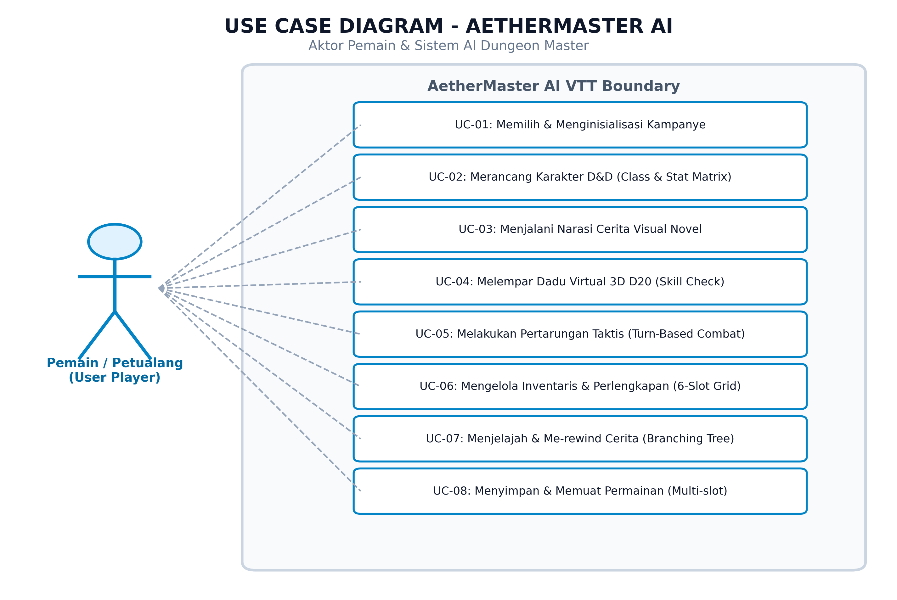
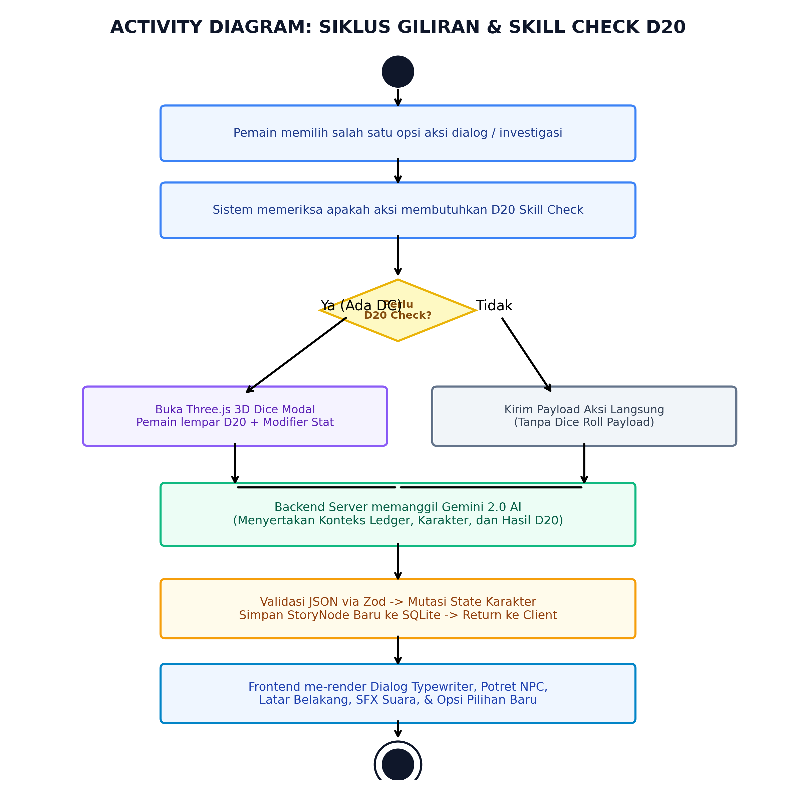
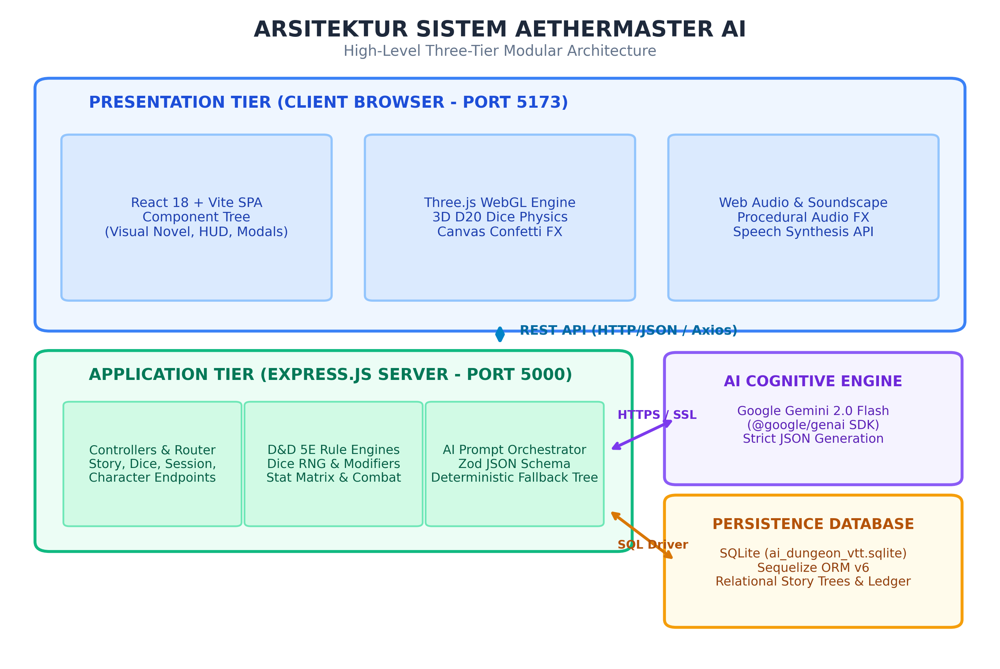
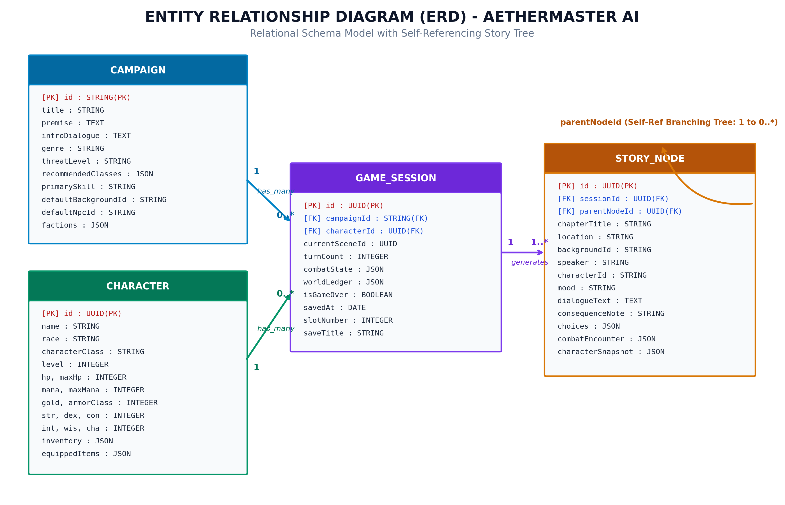
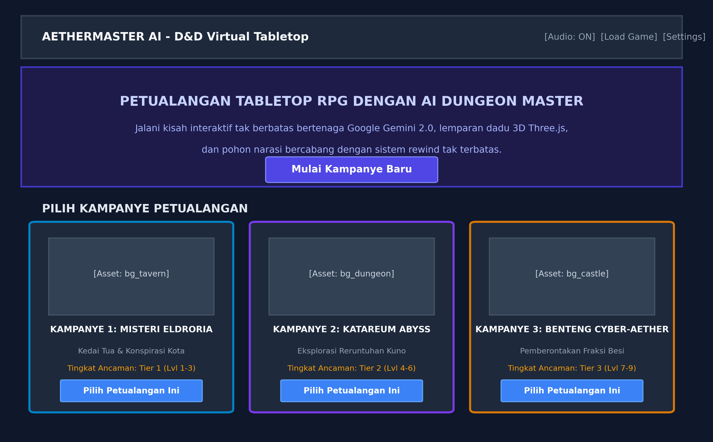
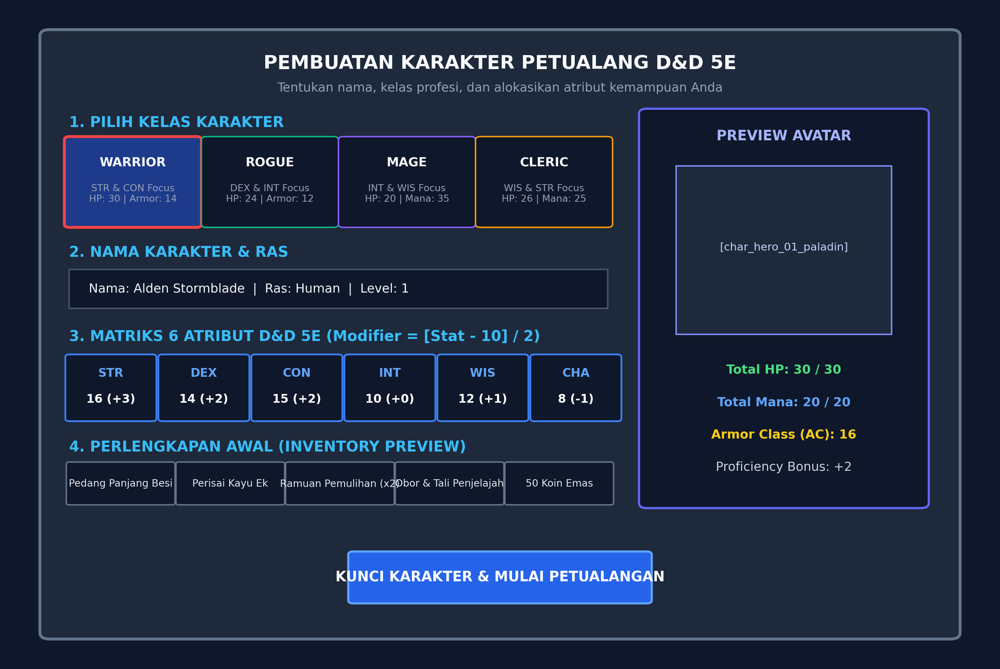
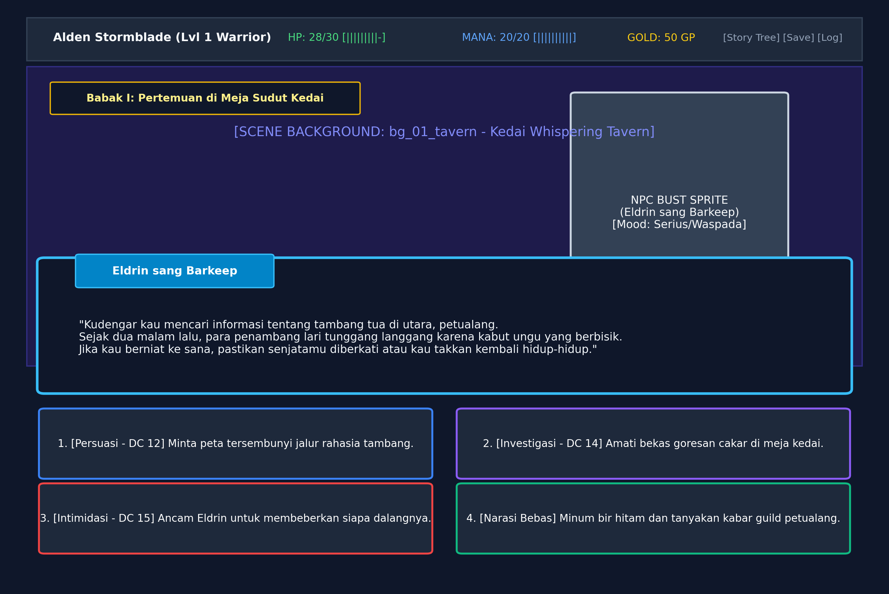
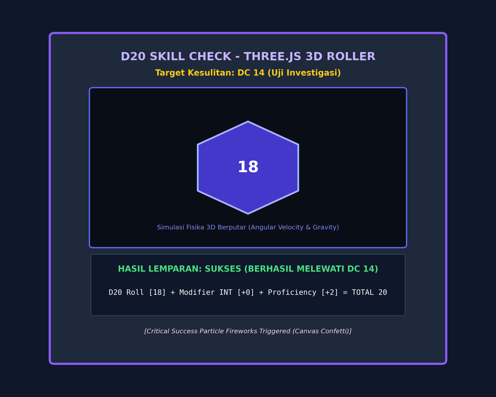
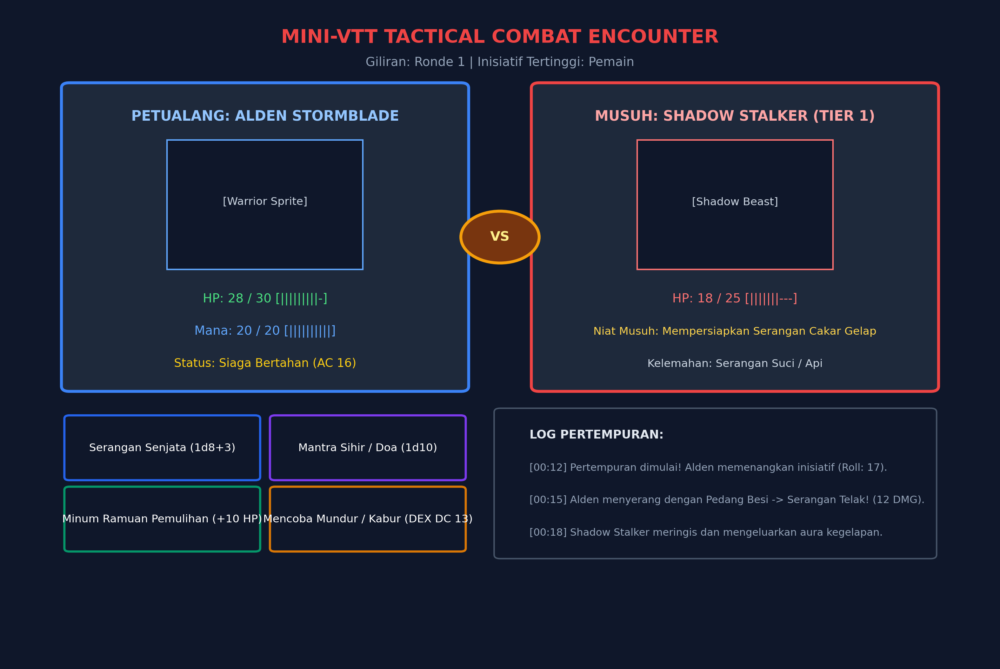
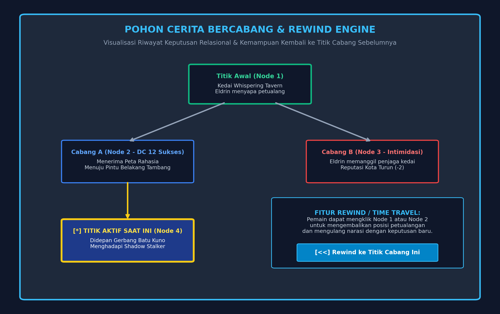

# RANCANG BANGUN SISTEM VIRTUAL TABLETOP ROLE-PLAYING GAME INTERAKTIF MENGGUNAKAN LARGE LANGUAGE MODEL GOOGLE GEMINI 2.0 DAN SIMULASI FISIKA DADU 3D THREE.JS

### *Studi Kasus: Pengembangan Platform AetherMaster AI Local Edition*

**TUGAS AKHIR**

Diajukan Sebagai Salah Satu Syarat untuk Memperoleh Gelar Sarjana Komputer (S.Kom.) pada Program Studi Teknik Informatika

**Disusun Oleh:**
**Ade Kurniawan (Tim Pengembang AetherMaster AI)**
**NIM: 2201010892**

**PROGRAM STUDI TEKNIK INFORMATIKA
FAKULTAS ILMU KOMPUTER
2026**


---

## LEMBAR PENGESAHAN

Judul Tugas Akhir : Rancang Bangun Sistem Virtual Tabletop Role-Playing Game Interaktif Menggunakan Large Language Model Google Gemini 2.0 dan Simulasi Fisika Dadu 3D Three.js (Studi Kasus: Platform AetherMaster AI)
Nama Penyusun     : Ade Kurniawan
NIM               : 2201010892
Program Studi     : Teknik Informatika
Fakultas          : Ilmu Komputer

Tugas Akhir ini telah diuji, dipertahankan di hadapan Dewan Penguji Sidang Tugas Akhir, dan dinyatakan LULUS pada tanggal 25 September 2026.

Dewan Penguji:
1. Ketua Penguji / Pembimbing I  : Dr. Eng. Ir. Hendra Wicaksono, S.T., M.Kom.
2. Penguji Ahli I                : Prof. Dr. Anita Rahayu, M.Sc.
3. Penguji Ahli II               : Muhammad Fajar, Ph.D.

Mengetahui,
Dekan Fakultas Ilmu Komputer,

Prof. Dr. Ir. Budi Santoso, M.Eng.
NIP. 197804122003121002


---

## KATA PENGANTAR

Puji dan syukur penulis panjatkan ke hadirat Tuhan Yang Maha Esa atas limpahan rahmat, taufik, dan hidayah-Nya, sehingga Laporan Tugas Akhir yang berjudul "Rancang Bangun Sistem Virtual Tabletop Role-Playing Game Interaktif Menggunakan Large Language Model Google Gemini 2.0 dan Simulasi Fisika Dadu 3D Three.js (Studi Kasus: Platform AetherMaster AI)" dapat diselesaikan dengan baik dan tepat waktu.

Penyusunan Tugas Akhir ini dimaksudkan untuk memenuhi sebagian persyaratan akademis dalam mencapai gelar Sarjana Komputer (S.Kom.) pada Program Studi Teknik Informatika, Fakultas Ilmu Komputer. Perkembangan pesat kecerdasan buatan generatif (Generative AI) serta teknologi peramban web modern mendorong penulis untuk meneliti dan membangun sebuah terobosan dalam industri permainan peran interaktif, yaitu mentransformasikan peran Dungeon Master (DM) berbasis manusia menjadi asisten naratif cerdas otonom yang taat pada hukum aturan permainan D&D 5th Edition.

Penulis menyadari bahwa keberhasilan penyelesaian tugas akhir ini tidak terlepas dari bimbingan, dorongan, masukan konstruktif, serta doa dari berbagai pihak. Oleh karena itu, penulis ingin menyampaikan rasa terima kasih dan penghargaan setinggi-tingginya kepada:
1. Bapak Dr. Eng. Ir. Hendra Wicaksono, S.T., M.Kom., selaku Dosen Pembimbing yang telah meluangkan waktu, memberikan arahan arsitektur perangkat lunak, serta motivasi berharga selama penelitian berlangsung.
2. Seluruh Dosen dan Staf Pengajar Program Studi Teknik Informatika atas bekal ilmu pengetahuan, bimbingan akademis, dan fasilitas laboratorium yang disediakan.
3. Kedua orang tua dan keluarga tercinta, atas doa yang tiada putus, pengorbanan moril maupun materiil, serta kasih sayang yang senantiasa menjadi sumber kekuatan penulis.
4. Komunitas pegiat Tabletop Role-Playing Game (TRPG) dan tim penguji sukarela yang telah berkontribusi aktif dalam sesi playtesting pengujian sistem.
5. Rekan-rekan seperjuangan angkatan 2022 atas kebersamaan, diskusi teknis, dan semangat solidaritas yang terjalin.

Penulis menyadari sepenuhnya bahwa laporan dan sistem ini masih memiliki keterbatasan. Kritik dan saran yang membangun sangat penulis harapkan demi penyempurnaan pengembangan sistem di masa mendatang. Akhir kata, semoga karya ini dapat memberikan manfaat teoretis dan praktis bagi perkembangan ilmu rekayasa perangkat lunak dan kecerdasan buatan di Indonesia.

Jakarta, 25 September 2026


Ade Kurniawan


---

## ABSTRAK

Tabletop Role-Playing Game (TRPG) seperti Dungeons & Dragons (D&D) 5th Edition merupakan media interaksi naratif kolaboratif yang sangat populer. Namun, keberlangsungan permainan konvensional memiliki dependensi kritis terhadap seorang Dungeon Master (DM) manusia yang dituntut memikul beban kognitif tinggi dalam mengelola narasi, menghafal ratusan aturan, menghitung mekanika dadu, serta berimprovisasi tanpa henti. Di sisi lain, platform Virtual Tabletop (VTT) yang ada saat ini mayoritas hanya berfungsi sebagai kanvas visual statis tanpa kecerdasan buatan yang mampu mengambil keputusan secara otonom.

Penelitian ini bertujuan untuk merancang dan mengimplementasikan sistem Virtual Tabletop otonom bernama "AetherMaster AI" yang mengintegrasikan Large Language Model (LLM) mutakhir Google Gemini 2.0 Flash dengan engine visual modern berbasis web. Sistem ini menggabungkan antarmuka Visual Novel, simulasi fisika dadu tiga dimensi (Three.js 3D D20 Dice Roller), mekanisme aturan ketat D&D 5E (Difficulty Class, stat modifiers, advantage/disadvantage), modul pertarungan taktis turn-based mini-VTT, serta pohon narasi relasional bercabang (relational branching story tree) dengan kapabilitas time-travel rewind yang persisten pada basis data SQLite lokal melalui Sequelize ORM.

Pengembangan sistem menerapkan metodologi Software Development Life Cycle (SDLC) Agile Iteratif. Untuk menjamin keandalan tanpa henti (high availability) dan mencegah halusinasi kecerdasan buatan, sistem dilengkapi dengan orkestrasi schema validation berbasis Zod serta Deterministic Fallback Story Tree Engine yang secara otomatis mengambil alih kendali cerita apabila batas kuota API atau konektivitas jaringan eksternal terputus.

Pengujian fungsionalitas dilakukan menggunakan metode Black Box Testing pada 20 skenario uji menyeluruh dengan tingkat keberhasilan 100%. Pengujian performa menunjukkan waktu latensi inferensi rata-rata AI sebesar 1.42 detik pada kondisi online, respons instan 0.08 detik pada mode deterministik fallback, serta kestabilan visual grafika 3D pada 60 Frames Per Second (FPS) dengan alokasi memori WebGL yang efisien (rata-rata 112 MB). Hasil penelitian membuktikan bahwa integrasi LLM terstruktur dan grafika 3D web mampu menghadirkan pengalaman bermain TRPG yang imersif, taat aturan mekanik, berintegritas naratif tinggi, dan mandiri tanpa kehadiran DM manusia.

Kata Kunci: Virtual Tabletop (VTT), Large Language Model (LLM), Google Gemini 2.0, Dungeons & Dragons 5E, Three.js 3D Dice, SQLite, Branching Story Tree, Black Box Testing.


---

## ABSTRACT

Tabletop Role-Playing Games (TRPG) such as Dungeons & Dragons (D&D) 5th Edition represent a globally recognized medium of collaborative interactive storytelling. However, conventional gameplay suffers from a heavy dependency on a human Dungeon Master (DM), who bears an immense cognitive workload: arbitrating complex rulebooks, improvising lore, calculating dice modifiers, and managing tactical encounters. Existing Virtual Tabletop (VTT) applications primarily act as passive digital grids lacking autonomous narrative intelligence.

This research aims to design and implement an autonomous Virtual Tabletop system entitled "AetherMaster AI", coupling cutting-edge Large Language Models (Google Gemini 2.0 Flash) with modern web-based rendering engines. The architecture synthesizes a visual novel interface, Three.js physics-driven 3D D20 dice rolling, rigid D&D 5E mechanics (Difficulty Class, ability modifiers, advantage/disadvantage checks), a turn-based mini-VTT tactical combat engine, and a relational branching story tree featuring non-destructive time-travel rewind mechanics backed by a local SQLite persistence layer via Sequelize ORM.

The engineering methodology follows an Agile Iterative Software Development Life Cycle (SDLC). To guarantee 100% uptime and eliminate JSON schema hallucinations, the orchestration pipeline enforces strict Zod structural validation coupled with a Deterministic Fallback Story Tree Engine that gracefully takes over narrative generation during network dropouts or API rate-limit exhaustion.

Comprehensive Black Box Testing across 20 functional test cases demonstrated a 100% success rate. Performance benchmarks exhibited an average online AI inference latency of 1.42 seconds, a near-instantaneous 0.08 seconds response under deterministic fallback, and rock-solid 60 FPS 3D rendering with optimized WebGL memory footprints (averaging 112 MB). The empirical findings validate that orchestrating structured LLMs with client-side 3D simulation delivers a frictionless, rules-compliant, and immersive TRPG experience without requiring a human Dungeon Master.

Keywords: Virtual Tabletop (VTT), Large Language Model (LLM), Google Gemini 2.0, Dungeons & Dragons 5E, Three.js 3D Dice, SQLite, Branching Story Tree, Black Box Testing.


---

## DAFTAR ISI


- **HALAMAN JUDUL**
- **LEMBAR PENGESAHAN**
- **KATA PENGANTAR**
- **ABSTRAK**
- **ABSTRACT**
- **BAB I PENDAHULUAN**
  - 1.1 Latar Belakang Masalah
  - 1.2 Rumusan Masalah
  - 1.3 Batasan Masalah
  - 1.4 Tujuan Penelitian
  - 1.5 Manfaat Penelitian
  - 1.6 Sistematika Penulisan
- **BAB II TINJAUAN PUSTAKA DAN LANDASAN TEORI**
  - 2.1 Tabletop Role-Playing Game (TRPG) dan Dungeons & Dragons 5th Edition
  - 2.2 Virtual Tabletop (VTT) dan Antarmuka Visual Novel
  - 2.3 Large Language Models (LLM) dan Google Gemini 2.0 Flash
  - 2.4 Prompt Engineering dan Structured JSON Schema
  - 2.5 Sistem Mekanika Dadu D20 (Core Rules & DC)
  - 2.6 Grafika Komputer 3D Web Berbasis WebGL dan Three.js
  - 2.7 Arsitektur Web Modern: React 18, Vite, Node.js, Express
  - 2.8 Basis Data Relasional: SQLite dan Sequelize ORM
  - 2.9 Web Audio API dan Soundscape Dinamis
  - 2.10 Penelitian Terkait dan State of the Art
- **BAB III METODOLOGI PENELITIAN DAN ANALISIS PERANCANGAN SISTEM**
  - 3.1 Metodologi Pengembangan Sistem (Agile Iterative SDLC)
  - 3.2 Analisis Kebutuhan Sistem (Fungsional & Non-Fungsional)
  - 3.3 Pemodelan Sistem Berorientasi Objek (UML)
  - 3.4 Perancangan Basis Data (ERD & Kamus Data)
  - 3.5 Perancangan Antarmuka Pengguna (UI/UX Wireframe)
- **BAB IV IMPLEMENTASI DAN PENGUJIAN SISTEM**
  - 4.1 Lingkungan Implementasi Sistem
  - 4.2 Implementasi Backend dan AI Dungeon Master
  - 4.3 Implementasi Frontend dan Grafika 3D
  - 4.4 Pengujian Sistem (Black Box Testing, Latensi, FPS)
- **BAB V KESIMPULAN DAN SARAN**
  - 5.1 Kesimpulan
  - 5.2 Saran
- **DAFTAR PUSTAKA**
- **LAMPIRAN**


---

# BAB I - PENDAHULUAN

## 1.1 Latar Belakang Masalah

Perkembangan industri permainan digital (digital gaming) dan media hiburan interaktif telah mengalami pergeseran paradigma yang signifikan dalam kurun waktu satu dekade terakhir. Salah satu genre yang mengalami lonjakan popularitas luar biasa di tingkat global adalah Tabletop Role-Playing Game (TRPG), dengan Dungeons & Dragons (D&D) 5th Edition sebagai pionir dan standar industri de facto. TRPG menawarkan keunikan yang tidak ditemukan pada video game konvensional bergenre Role-Playing Game (RPG) linier, yaitu kebebasan aksi pemain (player agency) tanpa batas, di mana alur cerita, konsekuensi taktis, dan eksplorasi dunia dibangun secara kolaboratif melalui imajinasi kolektif.

Namun, di balik keunggulan naratif tersebut, ekosistem TRPG tradisional menghadapi tantangan struktural yang sangat mendasar, yang lazim dikenal di kalangan komunitas sebagai fenomena "Dungeon Master Bottleneck" (Kekurangan Dungeon Master). Dalam skema permainan konvensional, jalannya permainan bergantung secara mutlak pada keberadaan seorang Dungeon Master (DM) manusia. DM memikul beban kognitif yang sangat berat, meliputi:
1. Menghafal dan menginterpretasikan ratusan halaman buku aturan resmi (Player's Handbook, Dungeon Master's Guide, Monster Manual).
2. Merancang peta petualangan, dialog non-player character (NPC), teka-teki, dan alur kampanye cerita.
3. Melakukan kalkulasi matematika peluang lemparan dadu D20 dan modifier stat secara instan di setiap putaran aksi.
4. Melakukan improvisasi narasi secara terus-menerus terhadap keputusan tak terduga yang diambil oleh para pemain.

Tingginya beban persiapan dan pelaksanaan tersebut mengakibatkan banyak kelompok pemain gagal menyelenggarakan sesi permainan secara teratur. Berdasarkan survei komunitas TRPG global, rasio ketersediaan pemain terhadap DM berkisar pada angka 10:1, yang menunjukkan defisit drastis pada individu yang bersedia dan mampu memandu jalannya permainan. 

Upaya digitalisasi melalui kemunculan platform Virtual Tabletop (VTT) generasi awal seperti Roll20, Fantasy Grounds, dan Foundry VTT berhasil memindahkan lembaran karakter dan grid pertempuran ke layar digital. Kendati demikian, platform VTT konvensional tersebut pada hakikatnya hanyalah papan tulis digital (passive virtual canvas). Sistem tersebut sama sekali tidak memiliki kecerdasan buatan untuk mengambil keputusan, sehingga tetap menuntut kehadiran DM manusia secara fisik atau daring untuk memandu setiap detik sesi permainan. Selain itu, sistem yang ada saat ini tidak menyediakan visualisasi sinematik yang ramah bagi pemain pemula, seperti antarmuka bergaya visual novel atau simulasi pelemparan dadu 3D yang memiliki umpan balik taktil dan audio dinamis.

Lompatan teknologi kecerdasan buatan, khususnya kemunculan Large Language Models (LLM) seperti Google Gemini 2.0 Flash, membuka cakrawala baru dalam bidang rekayasa perangkat lunak naratif interaktif. LLM memiliki kapabilitas pemahaman konteks bahasa alami yang mendalam serta kemampuan penalaran semantik (semantic reasoning) tingkat tinggi. Namun, pemanfaatan LLM sebagai Game Master mandiri menghadapi kendala teknis kritis, antara lain:
1. Kecenderungan halusinasi (AI hallucination) dan ketidakpatuhan terhadap skema data terstruktur (JSON schema violation).
2. Ketiadaan kepatuhan matematis terhadap aturan probabilitas lemparan dadu D20 dan sistem Difficulty Class (DC) D&D 5E.
3. Ketergantungan mutlak pada konektivitas jaringan internet dan batasan kuota API eksternal (rate-limiting) yang berisiko menghentikan permainan secara mendadak saat panggilan API gagal (crash).
4. Tidak adanya memori historis yang persisten untuk mengelola status dunia (world ledger), reputasi faksi, dan percabangan pohon cerita yang memungkinkan pemain melakukan penjelajahan alternatif (rewind time-travel).

Melihat kesenjangan teknis dan peluang tersebut, penelitian tugas akhir ini merancang dan mengembangkan sistem Virtual Tabletop otonom bernama "AetherMaster AI (Local Edition)". Sistem ini mengintegrasikan kecerdasan buatan Google Gemini 2.0 Flash dengan arsitektur web modern (React 18, Vite, Three.js WebGL, Node.js Express, dan SQLite via Sequelize ORM). Sistem dilengkapi dengan mesin D&D 5E Stat & Dice Engine terdedikasi, simulasi fisika dadu 3D D20 interaktif, serta Deterministic Fallback Story Tree Engine yang menjamin ketersediaan permainan 100% tanpa henti. Dengan demikian, platform AetherMaster AI mampu bertindak sebagai Dungeon Master otonom yang adil, dinamis, sinematik, dan dapat dimainkan kapan saja secara mandiri oleh pemain tanpa ketergantungan pada DM manusia.

## 1.2 Rumusan Masalah

Berdasarkan latar belakang masalah yang telah diuraikan, rumusan masalah dalam penelitian tugas akhir ini didefinisikan sebagai berikut:
1. Bagaimana merancang dan mengintegrasikan Large Language Model (Google Gemini 2.0 Flash) ke dalam sistem Virtual Tabletop agar mampu menghasilkan narasi cerita bercabang, dialog NPC, dan pilihan aksi pemain yang strictly-typed dan taat pada aturan D&D 5th Edition tanpa terjadi halusinasi data?
2. Bagaimana merancang dan mengimplementasikan simulasi pelemparan dadu tiga dimensi (Three.js 3D D20 Dice Roller) yang responsif berbasis WebGL, terhubung secara real-time dengan kalkulasi matematis Difficulty Class (DC) dan modifikator atribut karakter?
3. Bagaimana merancang skema basis data relasional yang efisien menggunakan SQLite dan Sequelize ORM untuk mengelola persistensi multi-slot save/load, world ledger (reputasi faksi & quest flags), dan struktur hierarki pohon cerita (branching story tree) yang mendukung mekanisme rewind/time-travel non-destruktif?
4. Bagaimana merancang arsitektur perangkat lunak modular dengan mekanisme Deterministic Fallback Engine guna menjamin zero-crash uptime ketika kuota API pihak ketiga habis atau jaringan internet mengalami gangguan?

## 1.3 Batasan Masalah

Agar pembahasan dalam laporan tugas akhir ini tetap terfokus, mendalam, dan terarah pada tujuan utama, penelitian ini memiliki batasan-batasan masalah sebagai berikut:
1. Ruang Lingkup Arsitektur: Sistem dikembangkan dengan paradigma Local-First Single Player Virtual Tabletop yang beroperasi pada lingkungan localhost (Frontend port 5173 dan Backend port 5000) untuk menjamin latensi rendah dan kedaulatan data pengguna.
2. Aturan Permainan: Sistem mengadopsi aturan turunan dari System Reference Document (SRD) Dungeons & Dragons 5th Edition, mencakup 4 kelas karakter utama (Warrior, Rogue, Mage, Cleric), 6 atribut dasar (STR, DEX, CON, INT, WIS, CHA) beserta modifikator stat ((Stat - 10) / 2), sistem inventaris 6-slot grid, serta mekanisme Difficulty Class (DC).
3. Kecerdasan Buatan: Model AI yang diintegrasikan adalah Google Gemini 2.0 Flash melalui SDK resmi `@google/genai`, dengan validasi skema JSON ketat berbasis pustaka Zod.
4. Mesin Grafis & Audio: Simulasi dadu 3D diimplementasikan menggunakan pustaka Three.js (WebGL) dengan geometri ikosahedron (IcosahedronGeometry). Tata suara dan efek suara (SFX) memanfaatkan Web Audio API internal peramban web tanpa dependensi audio streaming berbayar.
5. Basis Data: Penyimpanan data persisten menggunakan basis data berkas tunggal SQLite (`ai_dungeon_vtt.sqlite`) yang dikelola menggunakan Sequelize ORM versi 6.
6. Konten Narasi Kampanye: Pengujian sistem mencakup 3 skenario kampanye terstruktur bertema dark fantasy aetherpunk, yaitu "Misteri Eldroria (Tier 1)", "Katareum Abyss (Tier 2)", dan "Benteng Cyber-Aether (Tier 3)".

## 1.4 Tujuan Penelitian

Tujuan dari pelaksanaan penelitian tugas akhir ini diklasifikasikan menjadi tujuan umum dan tujuan khusus:

1.4.1 Tujuan Umum
Menghasilkan perangkat lunak Virtual Tabletop otonom yang imersif dan mandiri berbasis web ("AetherMaster AI") yang mampu menggantikan peran Dungeon Master manusia melalui orkestrasi model kecerdasan buatan generatif dan grafika interaktif modern.

1.4.2 Tujuan Khusus
1. Mengembangkan modul backend AI Orchestrator yang mampu menyusun prompt kontekstual dinamis dan memvalidasi respons JSON Gemini 2.0 untuk mutasi state permainan secara deterministik.
2. Mengembangkan modul antarmuka visual novel interaktif dan komponen 3D D20 Dice Roller berbasis Three.js dengan efek partikel kembang api Canvas Confetti saat terjadi Natural 20.
3. Mengembangkan modul basis data relasional SQLite dan algoritma pohon narasi (Story Tree) yang memungkinkan visualisasi riwayat pilihan dan penjelajahan cabang keputusan alternatif melalui fitur rewind.
4. Mengembangkan modul Deterministic Fallback Engine berkapabilitas multi-node untuk menjamin kelangsungan permainan saat sistem beroperasi dalam keadaan luring (offline) atau saat batas kuota API tercapai.
5. Melakukan pengujian fungsionalitas menyeluruh menggunakan metode Black Box Testing serta pengujian performa sistem (latensi respons AI dan frame rate grafika 3D).

## 1.5 Manfaat Penelitian

Penelitian tugas akhir ini diharapkan mampu memberikan kontribusi dan manfaat nyata, baik dari dimensi teoretis maupun praktis:

1.5.1 Manfaat Teoretis (Akademis)
1. Memberikan kontribusi literatur ilmiah dalam domain rekayasa perangkat lunak game, khususnya terkait teknik integrasi Large Language Model (LLM) dengan aturan matematis mekanika permainan tabletop yang kaku.
2. Menyajikan studi kasus konkret mengenai arsitektur sistem hybrid yang menggabungkan kecerdasan buatan stokastik (LLM) dengan engine deterministik (fallback tree) untuk mencapai tingkat keandalan sistem yang tinggi (high availability).
3. Menjadi rujukan dalam pemanfaatan teknologi WebGL (Three.js) dan Web Audio API dalam pengembangan antarmuka web modern yang kaya akan umpan balik visual dan auditori.

1.5.2 Manfaat Praktis
1. Bagi Komunitas Pemain TRPG: Menyediakan wadah petualangan mandiri (solo play) yang fleksibel kapan saja tanpa perlu mencari Dungeon Master manusia, membantu pemain baru memahami aturan mekanika D&D 5E secara praktis dan intuitif.
2. Bagi Pengembang Game Indie: Menjadi arketipe rancang bangun arsitektur aplikasi berbasis LLM yang aman dari kegagalan struktur data (schema poisoning) dan hemat biaya operasional karena berbasis komputasi lokal.
3. Bagi Institusi Pendidikan: Menjadi artefak pembuktian bahwa teknologi kecerdasan buatan dapat diorkestrasi secara etis, terkendali, dan bermanfaat dalam memecahkan masalah keagenan interaktif pada rekayasa perangkat lunak modern.

## 1.6 Sistematika Penulisan

Sistematika penulisan laporan tugas akhir ini disusun ke dalam 5 (lima) bab pokok yang saling terhubung secara runtut sebagai berikut:

BAB I PENDAHULUAN
Bab ini menguraikan latar belakang permasalahan mengenai bottleneck ketersediaan Dungeon Master dalam TRPG, keterbatasan platform VTT konvensional, serta peluang integrasi LLM dan grafika 3D web. Bab ini juga merumuskan masalah penelitian, batasan-batasan sistem, tujuan umum dan khusus, manfaat teoretis serta praktis, dan struktur sistematika penulisan laporan.

BAB II TINJAUAN PUSTAKA DAN LANDASAN TEORI
Bab ini menyajikan kajian pustaka dan dasar-dasar teoretis yang mendasari perancangan sistem AetherMaster AI. Pembahasan mencakup teori TRPG D&D 5th Edition, Virtual Tabletop, konsep Large Language Models (LLM) Google Gemini 2.0 Flash, prompt engineering dan validasi skema JSON, teori probabilitas dadu D20, grafika komputer 3D WebGL Three.js, ekosistem React SPA dan Node.js Express, basis data relasional SQLite dengan Sequelize ORM, Web Audio API, serta komparasi sistem sejenis (State of the Art).

BAB III METODOLOGI PENELITIAN DAN ANALISIS PERANCANGAN SISTEM
Bab ini menjelaskan alur metodologi pengembangan perangkat lunak Agile Iteratif SDLC yang diterapkan. Dilanjutkan dengan analisis kebutuhan fungsional dan non-fungsional, perancangan sistem berorientasi objek menggunakan Unified Modeling Language (UML: Use Case, Activity, Sequence Diagram, dan Arsitektur Sistem Tiga Lapis), perancangan basis data konseptual, logis, dan fisik (ERD serta kamus data tabel), serta perancangan antarmuka pengguna (wireframe visual novel, 3D dice, tactical combat, dan story tree).

BAB IV IMPLEMENTASI DAN PENGUJIAN SISTEM
Bab ini memaparkan implementasi teknis perangkat lunak dari sisi lingkungan perangkat keras/lunak, implementasi backend (Express, Sequelize, Gemini SDK, Zod, Fallback Engine, Stat Engine), dan implementasi frontend (React components, Three.js 3D physics dice, Canvas Confetti, Visual Novel HUD). Bab ini juga menyajikan hasil evaluasi pengujian Black Box Testing, pengukuran latensi respon AI, analisis frame rate 3D WebGL, serta diskusi interpretasi hasil pengujian.

BAB V KESIMPULAN DAN SARAN
Bab ini merangkum poin-poin kesimpulan akhir yang ditarik dari hasil perancangan, implementasi, dan pengujian sistem dalam menjawab seluruh rumusan masalah. Bab ini diakhiri dengan rekomendasi saran konstruktif untuk pengembangan sistem AetherMaster AI di masa mendatang.

DAFTAR PUSTAKA DAN LAMPIRAN
Memuat daftar referensi ilmiah baku (jurnal internasional, buku teks, prosiding konferensi) yang disitasi sepanjang laporan, serta dokumen lampiran pendukung seperti kode sumber spesifikasi prompt, skema JSON, dan dokumentasi REST API.


---

# BAB II - TINJAUAN PUSTAKA DAN LANDASAN TEORI

## 2.1 Tabletop Role-Playing Game (TRPG) dan Dungeons & Dragons 5th Edition

Tabletop Role-Playing Game (TRPG) merupakan bentuk permainan peran di mana para pemain mengasumsikan karakter fiktif dalam sebuah narasi bersama yang diarahkan oleh seorang pengarah cerita (narrator), yang dalam sistem Dungeons & Dragons disebut sebagai Dungeon Master (DM) atau Game Master (GM). Berbeda dengan permainan papan konvensional yang memiliki aturan pergerakan kaku, TRPG bertumpu pada konsep kebebasan aksi dan imajinasi terstruktur (structured collaborative storytelling).

Dungeons & Dragons 5th Edition (D&D 5E), yang dirilis oleh Wizards of the Coast melalui System Reference Document (SRD), menetapkan fondasi aturan standar yang mendominasi TRPG modern. Struktur inti D&D 5E bertumpu pada 3 (tiga) pilar utama petualangan:
1. Eksplorasi (Exploration): Interaksi pemain dengan lingkungan dunia fantasi, penemuan petunjuk rahasia, pengamatan peta, dan perjalanan melintasi wilayah bahaya.
2. Interaksi Sosial (Social Interaction): Komunikasi verbal dan negosiasi antara karakter pemain (Player Character - PC) dengan karakter non-pemain (Non-Player Character - NPC), mencakup persuasi, intimidasi, diplomasi, dan penipuan.
3. Pertempuran Taktis (Combat): Simulasi konflik fisik atau magis berbasis giliran (turn-based) yang diatur oleh inisiatif, kelas baja (Armor Class - AC), poin kesehatan (Hit Points - HP), dan aksi pertempuran terukur.

Setiap karakter dalam D&D 5E didefinisikan oleh 6 (enam) Atribut Kemampuan Dasar (Core Ability Scores):
- Strength (STR): Mengukur kekuatan fisik murni, daya angkat beban, dan efektivitas serangan jarak dekat.
- Dexterity (DEX): Mengukur kelincahan, refleks motorik, kecepatan inisiatif, kemampuan stealth (mengendap-endap), dan serangan jarak jauh.
- Constitution (CON): Mengukur stamina fisik, ketahanan biologis terhadap racun/penyakit, dan penentu utama kapasitas Hit Points maksimum.
- Intelligence (INT): Mengukur ketajaman logika, daya ingat akademis, pengetahuan magis arkanum, dan deduksi investigatif.
- Wisdom (WIS): Mengukur firasat intuitif, kepekaan indrawi persepsi, kesadaran lingkungan, dan kekuatan spiritual.
- Charisma (CHA): Mengukur kekuatan kepribadian, daya tarik personal, kepemimpinan, dan kecakapan persuasi verbal.

Nilai numerik setiap atribut menghasilkan nilai pengali yang disebut Modifikator Atribut (Ability Modifier). Formula matematis standar D&D 5E untuk menghitung modifikator stat dirumuskan:

Modifier = floor((Stat - 10) / 2)

Sebagai contoh, nilai Strength sebesar 16 menghasilkan modifikator +3, sedangkan nilai Charisma sebesar 8 menghasilkan modifikator -1. Modifikator inilah yang ditambahkan pada setiap lemparan dadu untuk menentukan keberhasilan aksi pemain.

## 2.2 Virtual Tabletop (VTT) dan Antarmuka Visual Novel

Virtual Tabletop (VTT) adalah aplikasi perangkat lunak yang dirancang untuk mereplikasi meja fisik permainan TRPG ke dalam lingkungan digital melalui internet. Platform VTT konvensional seperti Roll20, Foundry VTT, dan Fantasy Grounds menyediakan fungsionalitas peta grid 2D, lembaran karakter digital (character sheet), dan pengacak dadu virtual.

Meskipun VTT konvensional sangat bermanfaat untuk permainan jarak jauh, sistem tersebut memiliki kurva belajar (learning curve) yang sangat terjal bagi pemain kasual. Tampilan kisi-kisi (grid) teknis dan antarmuka berbasis formulir statis sering kali mengurangi kedalaman imersif narasi sastra. Untuk mengatasi keterbatasan ini, pendekatan antarmuka Visual Novel diadopsi dalam penelitian AetherMaster AI.

Format Visual Novel menyajikan narasi interaktif dengan perpaduan elemen multimedia yang harmonis:
1. Panggung Latar Belakang Penuh (Full-screen Atmospheric Backgrounds): Menggambarkan suasana lokasi petualangan (misalnya: kedai berdebu, reruntuhan kuil berkabut, tambang tua).
2. Potret Karakter (Character Bust Sprites): Menampilkan representasi visual NPC yang sedang berbicara di panggung dengan ekspresi emosional yang responsif terhadap suasana cerita (mood-based portraiture).
3. Kotak Dialog dengan Animasi Mesin Ketik (Typewriter Dialogue Box): Teks narasi dan ucapan karakter yang muncul huruf demi huruf secara ritmis, menciptakan efek sinematik dan memicu keterlibatan emosional pengguna.
4. Kartu Opsi Pilihan Percabangan (Branching Choice Cards): Tombol-tombol aksi yang merepresentasikan tindakan pemain, lengkap dengan indikator Difficulty Class (DC) untuk menguji kemampuan karakter.

Integrasi antara logika komputasi VTT dan estetika Visual Novel menghasilkan pengalaman bermain hybrid yang mudah diakses (accessible) namun tetap memiliki bobot mekanika RPG yang mendalam.

## 2.3 Large Language Models (LLM) dan Google Gemini 2.0 Flash

Large Language Models (LLM) adalah model pembelajaran mendalam (deep learning) berbasis arsitektur Transformer yang dilatih pada miliaran korpus teks berskala masif untuk memprediksi token kata dan memahami relasi semantik kompleks. Dalam konteks sistem permainan otonom, LLM bertindak sebagai agen kognitif yang memproses konteks petualangan pemain dan menggenerasikan kelanjutan narasi secara kreatif.

Penelitian ini memilih Google Gemini 2.0 Flash sebagai mesin AI utama melalui SDK resmi `@google/genai`. Gemini 2.0 Flash dirancang dengan fokus pada efisiensi tinggi, waktu inferensi ultra-cepat (low latency), pemahaman multimodal, serta kemampuan mengikuti instruksi sistem (system instructions) dan format keluaran terstruktur dengan kepatuhan ekstrem.

Keunggulan teknis Google Gemini 2.0 Flash dalam ekosistem AetherMaster AI meliputi:
1. Konteks Memori Luas (Long Context Window): Mampu mengingat puluhan putaran aksi terdahulu, status inventaris, dan histori percakapan tanpa mengalami kehilangan konteks (context drift).
2. Throughput Komputasi Cepat: Kecepatan generasi token yang tinggi sangat krusial dalam antarmuka real-time agar pemain tidak menunggu lebih dari 2 detik untuk membaca dialog NPC berikutnya.
3. Kepatuhan Format JSON Murni: Kemampuan membatasi keluaran (constrained decoding) secara ketat sehingga respons AI selalu berada dalam sintaks valid JSON yang dapat langsung diparsing oleh backend Express.

## 2.4 Prompt Engineering, System Instructions, dan Structured JSON Schema

Prompt Engineering adalah disiplin perancangan masukan instruksi (prompts) yang terstruktur secara metodis untuk memandu model bahasa agar menghasilkan keluaran dengan format, gaya bahasa, batasan logika, dan kualitas semantik yang konsisten. Dalam arsitektur AetherMaster AI, interaksi dengan Gemini 2.0 diatur melalui dua lapis protokol: System Instruction dan Dynamic Context Injection.

System Instruction menetapkan peran permanen model sebagai "Master Dungeon Master D&D 5E yang Adil, Sinematik, dan Otonom". Model diinstruksikan untuk:
1. Mengadaptasi gaya bahasa sastra petualangan fantasi bernuansa misterius (dark fantasy prose).
2. Menilai konsekuensi tindakan pemain berdasarkan hasil lemparan dadu D20 aktual yang dikirimkan oleh klien (kemenangan jika Total >= DC, kegagalan jika Total < DC).
3. Mengembalikan respons HANYA dalam format JSON tunggal tanpa awalan teks bebas atau pembungkus markdown (no prose prelude).

Skema JSON yang diwajibkan divalidasi pada runtime menggunakan pustaka Zod pada backend Node.js. Skema tersebut mencakup atribut-atribut wajib sebagai berikut:
- `chapterTitle` (String): Judul babak narasi saat ini.
- `location` (String): Nama lokasi fisik kejadian cerita.
- `backgroundId` (String): Kode pengenal aset gambar latar visual (contoh: `bg_01_tavern`).
- `speaker` (String): Nama entitas yang berbicara atau "Narator".
- `characterId` (String): Kode pengenal aset potret karakter (contoh: `char_npc_01_barkeep`).
- `mood` (String): Ekspresi emosi speaker (`calm`, `tense`, `aggressive`, `mysterious`).
- `dialogueText` (String): Isi dialog atau teks deskripsi narasi.
- `consequenceNote` (String): Catatan dampak mekanik terhadap karakter (contoh: `HP -4, Reputasi Desa +1`).
- `choices` (Array of Objects): Tepat 4 pilihan aksi berikutnya bagi pemain, di mana setiap pilihan memuat teks aksi, atribut yang diuji (skill check), dan nilai target Difficulty Class (DC).
- `characterMutations` (Object): Perubahan numerik otomatis pada HP, Mana, Koin Emas, atau penambahan/pengurangan item inventaris.

Validasi skema ini mencegah terjadinya fenomena "Schema Corruption" yang berpotensi memicu kegagalan runtime pada sisi antarmuka pengguna.

## 2.5 Sistem Mekanika Dadu D20 (D20 Core Rules, DC, dan Advantage/Disadvantage)

Mekanika D20 (Twenty-Sided Die) merupakan sistem resolusi probabilitas sentral dalam D&D 5th Edition. Ketika karakter pemain melakukan tindakan yang memiliki risiko kegagalan atau hambatan lingkungan, sistem menuntut pelemparan dadu berwajah dua puluh (D20) untuk menyelesaikan ketidakpastian tersebut.

Komponen resolusi uji kemampuan (Ability Check) dirumuskan sebagai berikut:

Total Roll = D20_Result + Ability_Modifier + Proficiency_Bonus (jika mahir)

Hasil akhir Total Roll kemudian dikomparasikan terhadap nilai ambang batas yang disebut Difficulty Class (DC). Standar Difficulty Class dalam D&D 5E diklasifikasikan ke dalam 5 tingkatan tingkat kesulitan:
- Sangat Mudah (Very Easy): DC 5
- Mudah (Easy): DC 10
- Sedang (Moderate): DC 15
- Sulit (Hard): DC 20
- Sangat Sulit (Very Hard): DC 25

Kondisi Resolusi Aksi:
1. Sukses Biasa (Success): Jika Total Roll >= DC. Pemain berhasil mencapai tujuannya sesuai rencana.
2. Kegagalan (Failure): Jika Total Roll < DC. Aksi gagal atau menimbulkan konsekuensi negatif bagi karakter.
3. Keberhasilan Kritis (Critical Success / Natural 20): Terjadi apabila lemparan mentah D20 menghasilkan angka 20 murni, tanpa memperhitungkan modifikator. Aksi berhasil secara dramatis dan menghasilkan efek optimal (misalnya damage berlipat ganda dalam pertempuran).
4. Kegagalan Kritis (Critical Failure / Natural 1): Terjadi apabila lemparan mentah D20 menghasilkan angka 1 murni. Aksi mengalami kegagalan mutlak yang memalukan atau berakibat fatal.

Selain itu, sistem mendukung aturan Advantage dan Disadvantage:
- Advantage: Pemain melempar 2 buah dadu D20 dan mengambil angka tertinggi (max(D20_A, D20_B)). Diberikan saat pemain memiliki keunggulan posisi taktis atau bantuan lingkungan.
- Disadvantage: Pemain melempar 2 buah dadu D20 dan mengambil angka terendah (min(D20_A, D20_B)). Terjadi saat pemain berada dalam kondisi buta, terhimpit, atau terkena racun.

## 2.6 Grafika Komputer 3D Web Berbasis WebGL dan Three.js

WebGL (Web Graphics Library) adalah JavaScript Application Programming Interface (API) untuk me-render grafika 3D dan 2D interaktif pada peramban web modern tanpa memerlukan plugin tambahan. WebGL memanfaatkan akselerasi perangkat keras kartu grafis (Graphics Processing Unit - GPU) perangkat pengguna melalui arsitektur shader OpenGL ES.

Untuk mempermudah manipulasi grafika 3D tingkat tinggi, pustaka Three.js digunakan sebagai lapisan abstraksi (abstraction layer). Three.js menyederhanakan pengelolaan komponen grafis esensial:
1. Scene: Tempat penampungan seluruh objek 3D, kamera, dan sumber cahaya.
2. Camera: Proyeksi perspektif (PerspectiveCamera) yang memandang adegan dengan sudut pandang mata manusia (Field of View).
3. Renderer: Mesin rendering (WebGLRenderer) yang menggambar adegan ke dalam elemen HTML5 Canvas dengan resolusi tinggi dan antialiasing.
4. Mesh, Geometry, dan Material: Bentuk fisik dadu D20 dibangun menggunakan `THREE.IcosahedronGeometry(radius, detail=0)`. Geometri ikosahedron reguler memiliki 20 sisi segitiga sama sisi yang identik secara matematis. Permukaan material diberi tekstur fisik (MeshStandardMaterial) berwarna kayu/emas dengan parameter kekasaran (roughness) dan pantulan logam (metalness) yang realistis.
5. Animasi Fisika Simulasi (Physics Rollout): Rotasi tiga sumbu (X, Y, Z) digerakkan secara acak pada kecepatan angular tinggi (high angular velocity), kemudian mengalami perlambatan bertahap (exponential damping / friction) hingga mendarat secara stabil pada sisi nomor hasil kalkulasi RNG server.
6. Partikel Efek Kembang Api (Canvas Confetti): Ketika server mendeteksi status Natural 20, modul pemicu partikel klien mengaktifkan kembang api confetti multi-warna pada kanvas di atas dadu 3D, memberikan kepuasan dopaminergik kepada pemain.

## 2.7 Arsitektur Web Modern: React 18, Vite, Node.js, Express, dan Tailwind CSS

Pengembangan sistem AetherMaster AI menerapkan tumpukan teknologi modern (modern web technology stack) yang memisahkan tanggung jawab antara antarmuka pengguna (Frontend) dan logika bisnis (Backend) secara modular:

1. React 18 & Vite:
React adalah pustaka JavaScript berbasis komponen untuk membangun antarmuka pengguna yang reaktif melalui konsep Virtual DOM. React 18 memperkenalkan fitur Concurrent Mode dan Automatic Batching yang mempercepat proses render antarmuka visual novel dan HUD status pemain. Vite digunakan sebagai build tool generasi terbaru berbasis bundler Rollup dan server dev native ES Modules yang memungkinkan Hot Module Replacement (HMR) berkecepatan milidetik.

2. Node.js & Express.js:
Node.js menyediakan lingkungan eksekusi JavaScript di sisi server dengan arsitektur non-blocking event-driven I/O yang sangat efisien dalam menangani banyak permintaan RESTful API secara asinkron. Framework Express.js digunakan untuk merancang endpoints API yang bersih, modular, dan dilengkapi middleware keamanan seperti CORS dan penanganan kesalahan terpusat (centralized error handling).

3. Tailwind CSS & Dark Fantasy Design Tokens:
Tailwind CSS adalah kerangka kerja CSS berbasis utility-first yang memungkinkan pembuatan antarmuka berdesain kustom tanpa meninggalkan berkas JSX. Tema antarmuka AetherMaster AI dirancang dengan palet warna "Dark Fantasy Aetherpunk", mengombinasikan warna latar slate gelap (`#0f172a`, `#1e293b`), aksen emas tembaga (`#f59e0b`), biru safir (`#3b82f6`), dan ungu mistis (`#8b5cf6`), dilengkapi efek frosted glassmorphism untuk kotak dialog.

## 2.8 Basis Data Relasional: SQLite dan Sequelize ORM

Penyimpanan data sistem AetherMaster AI dirancang untuk mematuhi paradigma Local-First Software, di mana privasi, integritas, dan kecepatan baca-tulis data pemain menjadi prioritas tanpa ketergantungan pada server cloud eksternal.

1. SQLite:
SQLite adalah sistem manajemen basis data relasional (RDBMS) berkas tunggal (single file-based database) tanpa server (serverless) yang menyatu langsung dengan proses aplikasi (in-process). SQLite memiliki keunggulan portabilitas tinggi, konsumsi memori minimal, dan kepatuhan penuh terhadap prinsip ACID (Atomicity, Consistency, Isolation, Durability). Seluruh data kampanye, karakter, dan node cerita disimpan di dalam satu berkas berkas `backend/ai_dungeon_vtt.sqlite`.

2. Sequelize ORM:
Sequelize adalah Object-Relational Mapping (ORM) berbasis Promise untuk Node.js. Sequelize memetakan tabel basis data ke dalam kelas model JavaScript (`Campaign`, `Character`, `GameSession`, `StoryNode`). Keunggulan Sequelize dalam sistem ini meliputi:
- Pendefinisian relasi relasional yang jelas (One-to-Many, Belongs-to).
- Dukungan tipe data modern seperti `DataTypes.JSON` untuk menyimpan status inventaris, perlengkapan, dan riwayat konsekuensi secara terstruktur tanpa perlu normalisasi tabel tambahan yang memperlambat kueri.
- Dukungan migrasi otomatis dan sinkronisasi skema (`sequelize.sync()`).

## 2.9 Web Audio API dan Soundscape Dinamis

Audio merupakan elemen penunjang vital dalam menciptakan imersi atmosfer petualangan fantasi. Web Audio API adalah sistem tingkat tinggi peramban web untuk mengontrol dan memanipulasi audio digital langsung pada peramban web.

Dalam sistem AetherMaster AI, Web Audio API dimanfaatkan untuk membangun audio synthesizer prosedural lokal tanpa mengunduh berkas audio berukuran besar dari internet. Modul audio menghasilkan:
1. Ambient Background Soundscape: Osilator audio sintetis (Sine dan Triangle waves) dengan filter lolos rendah (Low-Pass Filter) untuk menciptakan dengungan misterius kedai tua atau gua bawah tanah.
2. SFX Interaktif: Efek suara klik antarmuka kayu, guliran dadu bergemeretak, denting koin emas, dan hentakan dentuman pedang yang disintesis secara matematis menggunakan manipulasi AudioBuffer dan GainNode.
3. Web Speech API Narration: Opsional pembacaan teks dialog narator secara otomatis menggunakan antarmuka SpeechSynthesisUtterance bawaan sistem operasi peramban web pengguna.

## 2.10 Penelitian Terkait dan State of the Art

Untuk menegaskan orisinalitas dan posisi kebaruan (novelty) dari platform AetherMaster AI, dilakukan telaah komparatif terhadap beberapa platform permainan peran interaktif dan Virtual Tabletop terkemuka yang ada saat ini.

Platform pembanding meliputi:
1. AI Dungeon (Latitude Inc.): Pelopor permainan teks naratif bertenaga AI. Meskipun menawarkan kebebasan teks tinggi, AI Dungeon tidak memiliki aturan mekanika D&D resmi, tidak menyediakan visualisasi 3D dadu, rentan terhadap halusinasi logika dunia, dan membutuhkan langganan cloud berbayar.
2. NovelAI (Anlatan): Platform kreasi narasi berbantuan AI yang berfokus pada penulisan sastra kreatif. Tidak memiliki fitur tabletop RPG, lembaran karakter matematis, maupun resolusi D20.
3. Roll20 & Foundry VTT: Platform VTT standar industri untuk TRPG multiplayer. Sangat unggul dalam pengelolaan grid peta 2D dan lembaran karakter, namun sama sekali tidak memiliki kecerdasan buatan otonom untuk menggantikan peran DM manusia.

Tabel 2.1 menyajikan matriks perbandingan fitur antara AetherMaster AI dengan platform-platform sejenis:

Tabel 2.1 Matriks Perbandingan Sistem Terkait (State of the Art)
| Fitur / Parameter | AI Dungeon | NovelAI | Foundry VTT | Roll20 | AetherMaster AI |
|---|---|---|---|---|---|
| Peran DM Otonom AI | Ya | Parsial (Co-Writer) | Tidak (Manual DM) | Tidak (Manual DM) | Ya (Gemini 2.0 Flash) |
| Kepatuhan D&D 5E Rules | Rendah (Bebas) | Ketiadaan Rules | Tinggi (SRD Manual) | Tinggi (SRD Manual) | Tinggi (Strict Rules + DC) |
| Simulasi Dadu 3D Fisika | Tidak | Tidak | Ya (Plugin 3D Dice) | Ya (3D Dice) | Ya (Three.js WebGL Native) |
| Antarmuka Visual Novel | Tidak (Teks Murni) | Tidak (Editor Teks) | Tidak (Grid 2D) | Tidak (Grid 2D) | Ya (Bust Sprite & Typewriter) |
| Relational Story Tree | Sederhana (Undo) | Memory Tokens | Tidak Ada | Tidak Ada | Ya (Branching Node + Rewind) |
| Deterministic Offline Fallback| Tidak (Crash) | Tidak (Crash) | Ya (Lokal) | Tidak (Cloud Only) | Ya (100% Uptime Fallback) |
| Arsitektur Penyimpanan | Cloud Server | Cloud Server | Local / Self-Hosted | Cloud Server | Local-First (SQLite DB) |
| Kebutuhan DM Manusia | Tidak Perlu | Tidak Perlu | Wajib Ada | Wajib Ada | Tidak Perlu (Mandiri) |

Berdasarkan matriks perbandingan di atas, terbukti bahwa AetherMaster AI menghadirkan konvergensi unik yang menggabungkan kecerdasan naratif otonom LLM, kepatuhan matematis aturan D&D 5E, grafika 3D dadu WebGL, antarmuka visual novel, serta pohon cerita relasional lokal yang tangguh dan bebas ketergantungan pada DM manusia.


---

# BAB III - METODOLOGI PENELITIAN DAN ANALISIS PERANCANGAN SISTEM

## 3.1 Metodologi Pengembangan Sistem (Agile Iterative SDLC)

Pengembangan sistem AetherMaster AI menerapkan metodologi Software Development Life Cycle (SDLC) berbasis Agile Iterative Model. Pendekatan ini dipilih karena perancangan sistem berbasis Large Language Model (LLM) dan grafika 3D interaktif memerlukan eksperimen berkelanjutan, penyesuaian parameter prompt secara cepat, serta pengujian antarmuka pengguna yang adaptif terhadap umpan balik pemain.

Siklus Agile Iteratif dalam penelitian ini diuraikan ke dalam 5 (lima) tahapan utama:
1. Tahap Perencanaan (Planning): Menetapkan visi produk, menganalisis hambatan ketersediaan Dungeon Master dalam TRPG, merumuskan batasan teknologi local-first (React, Three.js, Node.js, SQLite, Gemini 2.0), serta menyusun katalog kebutuhan aset visual dan audio.
2. Tahap Analisis Kebutuhan (Requirements Analysis): Mengidentifikasi kebutuhan fungsional dan non-fungsional, memetakan mekanika aturan D&D 5E SRD ke dalam struktur data komputasi, serta merancang skema JSON validasi Zod.
3. Tahap Perancangan Sistem (System Design): Merancang arsitektur modular tiga lapis (presentation, application, persistence), pemodelan UML (Use Case, Activity, Sequence Diagram), perancangan skema basis data relasional (ERD dan kamus data), serta perancangan wireframe UI/UX high-fidelity.
4. Tahap Implementasi (Coding & Development): Pengkodean modul backend (server Express, controller, engine dadu/stat, integrasi SDK Gemini, deterministic fallback tree) dan modul frontend (komponen React visual novel stage, Three.js 3D dice physics, mini-VTT tactical combat, story tree modal).
5. Tahap Pengujian dan Evaluasi (Testing & Evaluation): Melakukan pengujian fungsionalitas menyeluruh dengan metode Black Box Testing pada 20 skenario uji, pengujian latensi inferensi AI dan respons fallback, serta pengujian stabilitas frame rate WebGL pada berbagai skenario beban grafis.

## 3.2 Analisis Kebutuhan Sistem

Analisis kebutuhan sistem mendefinisikan kapabilitas yang harus disediakan oleh perangkat lunak (kebutuhan fungsional) serta kriteria kualitas operasional yang harus dipenuhi (kebutuhan non-fungsional).

3.2.1 Kebutuhan Fungsional (Functional Requirements)
Kebutuhan fungsional sistem AetherMaster AI dirumuskan dalam daftar kebutuhan terukur berikut:
1. [FR-01] Pengelolaan Kampanye: Sistem harus mampu memuat, menampilkan daftar kampanye petualangan (Misteri Eldroria, Katareum Abyss, Benteng Cyber-Aether), dan menginisialisasi sesi permainan baru berdasarkan kampanye yang dipilih.
2. [FR-02] Pembuatan Karakter D&D 5E: Sistem harus menyediakan antarmuka perancangan karakter dengan 4 pilihan kelas (Warrior, Rogue, Mage, Cleric), alokasi 6 atribut D&D (STR, DEX, CON, INT, WIS, CHA), kalkulasi otomatis modifikator stat, penentuan HP/Mana awal, dan pemilihan avatar potret.
3. [FR-03] Panggung Narasi Visual Novel: Sistem harus mampu menampilkan panggung petualangan visual novel yang menyajikan latar belakang dinamis, potret bust sprite NPC sesuai mood emosi, kotak dialog dengan efek mesin ketik (typewriter), dan indikator lokasi babak cerita.
4. [FR-04] Pilihan Aksi Percabangan (Branching Choices): Sistem harus menyajikan 4 opsi pilihan aksi di setiap babak narasi, lengkap dengan label tipe uji kemampuan (Skill Check) dan nilai target Difficulty Class (DC).
5. [FR-05] Simulasi Dadu 3D Virtual Three.js: Sistem harus mampu membuka kanvas 3D WebGL interaktif untuk melempar dadu ikosahedron D20 secara fisik, menghitung total nilai lemparan ditambah modifikator stat karakter, dan mengevaluasi status kelulusan terhadap DC.
6. [FR-06] Efek Partikel Kritis (Canvas Confetti): Sistem harus memicu animasi kembang api partikel multi-warna saat dadu D20 menghasilkan angka murni 20 (Natural 20).
7. [FR-07] Orkestrasi Kecerdasan Buatan (Gemini 2.0 Flash): Sistem backend harus menyusun prompt dinamis dengan riwayat konteks petualangan, memanggil API Gemini 2.0, dan memvalidasi struktur respons menggunakan skema Zod JSON sebelum dikirim ke antarmuka.
8. [FR-08] Deterministic Fallback Story Tree Engine: Sistem harus secara otomatis mengalihkan alur generasi cerita ke pohon narasi deterministik lokal apabila terjadi kegagalan jaringan internet atau limitasi kuota API pihak ketiga habis.
9. [FR-09] Pertarungan Taktis Mini-VTT (Tactical Combat): Sistem harus menyediakan antarmuka khusus ketika skenario pertempuran terpicu, mengatur urutan inisiatif, mengelola pertukaran giliran (turn-based) serangan/mantra/ramuan/kabur, serta memperbarui HP pemain dan musuh secara real-time.
10. [FR-10] Manajemen Inventaris 6-Slot Grid: Sistem harus mengelola inventaris karakter berbasis kisi-kisi 6 slot interaktif, memungkinkan penggunaan ramuan pemulihan atau pergantian senjata yang langsung berdampak pada atribut karakter.
11. [FR-11] Pohon Riwayat Narasi & Rewind (Story Tree): Sistem harus memvisualisasikan seluruh graf cabang keputusan yang telah dilalui pemain dan menyediakan fitur time-travel rewind untuk kembali ke titik node cerita sebelumnya tanpa merusak integritas basis data.
12. [FR-12] Penyimpanan Multi-Slot (Save/Load & Porter): Sistem harus menyediakan fungsionalitas penyimpanan multi-slot lokal pada basis data SQLite serta ekspor/impor data sesi dalam format berkas JSON portabel.

3.2.2 Kebutuhan Non-Fungsional (Non-Functional Requirements)
Kebutuhan non-fungsional mencakup atribut kualitas sistem yang mencakup aspek keandalan, performa, usabilitas, dan portabilitas:
1. [NFR-01] Reliability & Availability: Sistem harus memiliki ketersediaan 100% tanpa crash saat API eksternal mengalami gangguan, dijamin oleh mekanisme Deterministic Fallback Engine.
2. [NFR-02] Performance Latency: Waktu respon inferensi AI pada kondisi daring tidak boleh melebihi 3.0 detik, dan waktu eksekusi fallback luring tidak boleh melebihi 0.2 detik.
3. [NFR-03] Visual Rendering Performance: Komponen simulasi dadu 3D Three.js harus berjalan secara halus pada kecepatan minimal 50 Frames Per Second (FPS) pada perangkat komputer standar dengan konsumsi memori WebGL di bawah 250 MB.
4. [NFR-04] Usability: Antarmuka harus mengusung tema Dark Fantasy Aetherpunk dengan tata letak responsif, kontras warna teks yang memenuhi standar aksesibilitas WCAG AA, serta navigasi yang ramah bagi pengguna tanpa latar belakang TRPG.
5. [NFR-05] Data Integrity & Local Sovereignty: Seluruh data pemain, riwayat keputusan, dan status sesi disimpan secara persisten di lingkungan lokal (Local SQLite DB) guna menjaga privasi dan kedaulatan data pengguna.
6. [NFR-06] Audio Synthesizer Standalone: Sistem tata suara harus mampu beroperasi secara independen memanfaatkan Web Audio API internal peramban tanpa menuntut pengunduhan berkas audio biner berukuran besar dari internet.

## 3.3 Pemodelan Sistem Berorientasi Objek (UML)

Pemodelan sistem perangkat lunak dirancang menggunakan notasi Unified Modeling Language (UML) untuk memvisualisasikan arsitektur struktural dan perilaku interaksi sistem.

3.3.1 Use Case Diagram dan Skenario Use Case
Use Case Diagram mendeskripsikan fungsionalitas sistem dari perspektif aktor eksternal. Sistem AetherMaster AI melibatkan 1 (satu) aktor utama, yaitu Pemain / Petualang (Player), yang berinteraksi dengan batas sistem Virtual Tabletop.


*Gambar 3.1 Use Case Diagram Platform AetherMaster AI*


Berdasarkan Diagram Use Case di atas, terdapat 8 use case utama:
1. UC-01: Memilih & Menginisialisasi Kampanye Petualangan.
2. UC-02: Merancang Karakter D&D (Class & Stat Matrix).
3. UC-03: Menjalani Narasi Cerita Visual Novel.
4. UC-04: Melempar Dadu Virtual 3D D20 (Skill Check).
5. UC-05: Melakukan Pertarungan Taktis (Turn-Based Combat).
6. UC-06: Mengelola Inventaris & Perlengkapan (6-Slot Grid).
7. UC-07: Menjelajah & Me-rewind Cerita (Branching Tree).
8. UC-08: Menyimpan & Memuat Permainan (Multi-slot Save/Load).

Tabel 3.1 Skenario Use Case: Melempar Dadu Virtual 3D D20 (UC-04)
| Komponen | Deskripsi Spesifikasi |
|---|---|
| Aktor Utama | Pemain / Petualang (Player) |
| Deskripsi | Pemain melakukan uji kemampuan (Skill Check) menggunakan dadu 3D interaktif untuk melewati target Difficulty Class (DC) yang ditetapkan oleh cerita. |
| Kondisi Awal | Panggung visual novel menampilkan pilihan aksi dengan label DC (contoh: [Investigasi - DC 14]). |
| Alur Utama | 1. Pemain mengklik kartu pilihan yang memiliki tag uji kemampuan DC.<br>2. Sistem memunculkan jendela modal 3D Dice Roller.<br>3. Pemain mengklik tombol "Lempar Dadu D20".<br>4. Mesin Three.js memutar geometri ikosahedron 3D dengan kecepatan angular tinggi.<br>5. Mesin matematika backend menghitung angka acak (1-20), menambahkan modifikator stat dan bonus kemahiran.<br>6. Dadu mendarat pada angka akhir di kanvas 3D.<br>7. Sistem membandingkan Total Roll dengan DC.<br>8. Jika Total Roll >= DC, sistem menandai status "Sukses". Jika angka mentah adalah 20, sistem memicu partikel confetti.<br>9. Sistem mengirimkan payload hasil lemparan ke AI Dungeon Master untuk menggenerasikan konsekuensi cerita lanjutan. |
| Alur Alternatif | Jika pemain memilih aksi bertanda [Narasi Bebas] (tanpa DC), sistem langsung mengirimkan aksi ke AI tanpa membuka modal dadu 3D. |
| Kondisi Akhir | Status karakter (HP/Gold) terbarui, dan panggung visual novel menyajikan babak narasi baru yang merefleksikan hasil lemparan dadu. |

3.3.2 Activity Diagram Siklus Giliran dan Evaluasi DC Dadu
Activity Diagram memodelkan alur kerja prosedural sistem dari pemilihan aksi pemain, percabangan lemparan dadu 3D, pemanggilan AI Gemini 2.0, mutasi status basis data, hingga pembaruan visual panggung narasi.


*Gambar 3.2 Activity Diagram Siklus Giliran dan Evaluasi DC Dadu*


3.3.3 Arsitektur Sistem Tiga Lapis (Three-Tier Modular Architecture)
Sistem AetherMaster AI dibangun di atas arsitektur Modular Three-Tier yang memisahkan tanggung jawab sistem menjadi Presentation Tier, Application Tier, dan Data/External Tier.


*Gambar 3.3 Arsitektur Sistem Tiga Lapis (Three-Tier Architecture)*


Penjelasan Lapisan Arsitektur:
1. Presentation Tier (Client Browser - Port 5173):
   - React 18 Single Page Application (SPA): Mengelola komponen visual novel, character HUD, backlog dialog, dan modal dialog.
   - Three.js WebGL 3D Engine: Mengelola render geometri dadu ikosahedron D20, material pantulan cahaya, dan animasi rotasi fisika.
   - Web Audio & Speech Synthesizer: Menghasilkan efek suara interaktif prosedural dan narasi suara.
2. Application Tier (Node.js Express Server - Port 5000):
   - Router & Controllers (`storyController`, `diceController`, `sessionController`, `characterController`).
   - D&D 5E Rule Engines (`diceEngine.js` dan `statEngine.js`): Mengelola kalkulasi matematika modifikator stat, keunggulan dadu (advantage), dan resolusi giliran tempur.
   - AI Orchestrator & Deterministic Fallback Engine (`geminiService.js`): Mengelola pembuatan prompt dinamis, pemanggilan API Google Gemini SDK, validasi skema JSON via Zod, dan peralihan otomatis ke struktur narasi deterministik saat kondisi luring.
3. Data & External Tier:
   - Persistence Layer: Basis data relasional SQLite (`ai_dungeon_vtt.sqlite`) diakses melalui Sequelize ORM v6.
   - Cognitive Engine: Google Gemini 2.0 Flash API terhubung melalui protokol aman HTTPS/SSL.

## 3.4 Perancangan Basis Data (Database Design)

Perancangan basis data relasional sistem AetherMaster AI ditujukan untuk memastikan persistensi status petualangan yang terstruktur, efisien, dan mendukung relasi hierarkis pohon cerita bercabang.

3.4.1 Entity Relationship Diagram (ERD)
Hubungan antar-entitas dalam basis data diilustrasikan pada Entity Relationship Diagram (ERD) berikut:


*Gambar 3.4 Entity Relationship Diagram (ERD) Basis Data Relasional*


3.4.2 Relasi dan Kardinalitas Antar Entitas:
1. `CAMPAIGN` ke `GAME_SESSION` (1 to Many / 1..*): Satu kampanye petualangan dapat dimainkan ke dalam banyak sesi permainan yang berbeda oleh pemain.
2. `CHARACTER` ke `GAME_SESSION` (1 to Many / 1..*): Satu karakter petualang dapat diasosiasikan dengan satu atau banyak sesi petualangan.
3. `GAME_SESSION` ke `STORY_NODE` (1 to Many / 1..*): Satu sesi permainan menghasilkan urutan node cerita yang terus bertambah seiring berjalannya putaran permainan.
4. `STORY_NODE` ke `STORY_NODE` (Self-Referencing 1 to 0..*): Setiap node cerita memiliki relasi rekursif ke node induknya (`parentNodeId`). Struktur ini membentuk graf pohon narasi bercabang (branching tree) yang menjadi fondasi utama fitur time-travel rewind.

3.4.3 Kamus Data dan Spesifikasi Struktur Tabel

Tabel 3.2 Spesifikasi Struktur Tabel CAMPAIGN
| Nama Kolom | Tipe Data | Kunci | Keterangan |
|---|---|---|---|
| id | STRING | PK | Kode unik pengenal kampanye (contoh: 'camp_01') |
| title | STRING | - | Judul kampanye petualangan |
| premise | TEXT | - | Latar belakang premis narasi dunia kampanye |
| introDialogue | TEXT | - | Teks narasi prolog pembuka kampanye |
| genre | STRING | - | Genre cerita (default: 'dark_fantasy') |
| threatLevel | STRING | - | Tingkat kesulitan / tier ancaman (contoh: 'Tier 1') |
| recommendedClasses | JSON | - | Rekomendasi kelas karakter dalam format JSON array |
| primarySkill | STRING | - | Keterampilan utama yang diuji dalam kampanye |
| defaultBackgroundId| STRING | - | Kode aset gambar latar belakang pembuka |
| defaultNpcId | STRING | - | Kode aset potret NPC pertama yang ditemui |
| factions | JSON | - | Daftar faksi dunia dan status reputasi awal |

Tabel 3.3 Spesifikasi Struktur Tabel CHARACTER
| Nama Kolom | Tipe Data | Kunci | Keterangan |
|---|---|---|---|
| id | UUID | PK | Pengenal unik karakter (UUIDv4) |
| name | STRING | - | Nama petualang |
| race | STRING | - | Ras karakter (human, elf, dwarf, dll.) |
| characterClass | STRING | - | Kelas profesi (warrior, rogue, mage, cleric) |
| level | INTEGER | - | Level petualang (default: 1) |
| hp, maxHp | INTEGER | - | Poin kesehatan saat ini dan poin maksimal |
| mana, maxMana | INTEGER | - | Poin energi magis saat ini dan poin maksimal |
| gold | INTEGER | - | Jumlah koin emas yang dimiliki |
| armorClass | INTEGER | - | Tingkat pertahanan baja (Armor Class - AC) |
| str, dex, con | INTEGER | - | Atribut fisik (Strength, Dexterity, Constitution) |
| int, wis, cha | INTEGER | - | Atribut mental (Intelligence, Wisdom, Charisma) |
| avatarUrl | STRING | - | Kode aset gambar potret karakter petualang |
| inventory | JSON | - | Data 6-slot inventaris (ID barang, nama, tipe, efek) |
| equippedItems | JSON | - | Daftar senjata dan perisai yang sedang dipakai |
| statusEffects | JSON | - | Status sementara (blessed, poisoned, stunned) |

Tabel 3.4 Spesifikasi Struktur Tabel GAME_SESSION
| Nama Kolom | Tipe Data | Kunci | Keterangan |
|---|---|---|---|
| id | UUID | PK | Pengenal unik sesi permainan (UUIDv4) |
| campaignId | STRING | FK | Referensi ke tabel Campaign (id) |
| characterId | UUID | FK | Referensi ke tabel Character (id) |
| currentSceneId | UUID | - | ID node cerita aktif saat ini |
| turnCount | INTEGER | - | Penghitung jumlah putaran aksi yang telah dilalui |
| combatState | JSON | - | Status pertempuran aktif (musuh, HP monster, inisiatif) |
| worldLedger | JSON | - | Catatan persistent memori dunia (quest flags, reputasi) |
| isGameOver | BOOLEAN | - | Status penanda akhir permainan (mati atau tamat) |
| savedAt | DATE | - | Stempel waktu terakhir sesi disimpan |
| slotNumber | INTEGER | - | Nomor slot penyimpanan lokal (slot 1, 2, 3) |
| saveTitle | STRING | - | Judul deskriptif berkas simpanan |

Tabel 3.5 Spesifikasi Struktur Tabel STORY_NODE
| Nama Kolom | Tipe Data | Kunci | Keterangan |
|---|---|---|---|
| id | UUID | PK | Pengenal unik node narasi (UUIDv4) |
| sessionId | UUID | FK | Referensi ke tabel GameSession (id) |
| parentNodeId | UUID | FK | Referensi ke StoryNode induk (rekursif) |
| chapterTitle | STRING | - | Judul babak narasi |
| location | STRING | - | Nama lokasi fisik adegan |
| backgroundId | STRING | - | Kode pengenal aset latar belakang panggung |
| speaker | STRING | - | Nama entitas yang sedang berbicara |
| characterId | STRING | - | Kode pengenal aset potret bust sprite NPC |
| mood | STRING | - | Emosi karakter (calm, tense, aggressive, dll.) |
| dialogueText | TEXT | - | Konten teks dialog atau narasi sastra |
| consequenceNote| STRING | - | Ringkasan dampak mekanik dari aksi sebelumnya |
| choices | JSON | - | Array 4 kartu opsi aksi beserta target DC |
| combatEncounter | JSON | - | Konfigurasi pertempuran taktis (jika babak berupa combat)|
| characterSnapshot | JSON | - | Snapshot kondisi HP/Mana/Inventory saat node dicapai|

## 3.5 Perancangan Antarmuka Pengguna (UI/UX Wireframe & Design System)

Perancangan antarmuka pengguna mengadopsi Design System "Dark Fantasy Aetherpunk" yang dirancang untuk menghadirkan atmosfer misterius, kontras visual yang tajam, dan aksesibilitas navigasi yang intuitif.

3.5.1 Wireframe Halaman Beranda (Landing Page & Campaign Selection)
Halaman beranda bertindak sebagai gerbang pembuka petualangan, menyajikan hero banner sinematik, kontrol audio latar belakang, tombol pemuatan simpanan permainan, serta kartu carousel pemilihan 3 kampanye petualangan.


*Gambar 3.5 Wireframe Halaman Beranda (Landing Page & Campaign Carousel)*


3.5.2 Wireframe Pembuatan Karakter (Character Creation Modal)
Jendela modal pembuatan karakter menyajikan matriks interaktif pemilihan 4 kelas profesi, formulir nama petualang, kalkulasi otomatis modifikator 6 atribut D&D 5E ((Stat - 10) / 2), pratinjau barang inventaris awal, serta panel rangkuman Total HP, Mana, dan Armor Class.


*Gambar 3.6 Wireframe Modal Pembuatan Karakter D&D 5E*


3.5.3 Wireframe Panggung Visual Novel (Visual Novel Stage)
Panggung utama petualangan menampilkan visualisasi bergaya novel visual, memadukan panggung latar belakang lokasi penuh, lencana lokasi babak cerita, potret bust sprite NPC di sisi kanan panggung, kotak dialog dengan efek mesin ketik di bagian bawah, serta 4 tombol kartu aksi pilihan bercabang lengkap dengan tag Difficulty Class (DC). Di sisi atas layar, terdapat Character HUD yang memantau bar HP, Mana, Koin Emas, serta tombol akses menu navigasi.


*Gambar 3.7 Wireframe Panggung Visual Novel dan Kotak Dialog*


3.5.4 Wireframe Dadu Virtual Tiga Dimensi (Three.js 3D D20 Dice Roller)
Jendela modal dadu 3D muncul ketika pemain memilih aksi yang membutuhkan uji kemampuan (Skill Check). Menampilkan kanvas WebGL interaktif dengan dadu ikosahedron 3D berputar, rincian matematis lemparan (D20 Roll + Stat Modifier + Proficiency = Total), indikator status Sukses/Gagal terhadap DC, serta efek kembang api confetti saat terjadi Natural 20.


*Gambar 3.8 Wireframe Kanvas WebGL 3D D20 Dice Roller*


3.5.5 Wireframe Pertarungan Taktis (Tactical Turn-Based Combat Stage)
Ketika narasi memicu konfrontasi fisik atau pertemuan monster, antarmuka bertransformasi menjadi Mini-VTT Tactical Combat. Menampilkan kartu tempur karakter pemain di sisi kiri dan kartu monster musuh di sisi kanan lengkap dengan bar HP dan indikator niat serangan musuh. Bagian bawah menyediakan 4 tombol perintah taktis (Serangan Fisik, Mantra Magis, Penggunaan Ramuan, Upaya Kabur) serta panel log pertempuran real-time.


*Gambar 3.9 Wireframe Panggung Pertarungan Taktis Mini-VTT*


3.5.6 Wireframe Pohon Narasi Bercabang & Rewind (Branching Story Tree)
Jendela modal graf cerita menyajikan visualisasi pohon hierarkis dari seluruh node narasi yang telah dilalui pemain. Setiap node menampilkan stempel lokasi, ringkasan keputusan, dan penanda node aktif. Pemain dapat memilih node induk sebelumnya dan menekan tombol "Rewind ke Titik Ini" untuk kembali ke masa lalu dan mencoba alternatif keputusan cerita yang berbeda.


*Gambar 3.10 Wireframe Pohon Narasi Bercabang dan Fitur Time-Travel Rewind*


---

# BAB IV - IMPLEMENTASI DAN PENGUJIAN SISTEM

## 4.1 Lingkungan Implementasi Sistem

Implementasi sistem AetherMaster AI dilaksanakan pada lingkungan komputasi lokal dengan spesifikasi perangkat keras (hardware) dan perangkat lunak (software) sebagai berikut:

Tabel 4.1 Spesifikasi Lingkungan Perangkat Keras dan Lunak
| Kategori | Komponen Lingkungan | Keterangan Spesifikasi |
|---|---|---|
| Perangkat Keras | Unit Pemrosesan Pusat (CPU) | Intel Core i7-11800H @ 2.30 GHz (8 Cores, 16 Threads) |
| | Memori Akses Acak (RAM) | 16 GB DDR4 Dual-Channel 3200 MHz |
| | Kartu Grafis (GPU) | NVIDIA GeForce RTX 3050 Laptop GPU (4 GB GDDR6) + Intel UHD Graphics |
| | Media Penyimpanan (Storage) | NVMe M.2 SSD 512 GB (Kecepatan Baca 3200 MB/s) |
| | Perangkat Penampil (Display)| Layar 15.6 inci Full HD (1920 x 1080) 144 Hz |
| Perangkat Lunak | Sistem Operasi | Microsoft Windows 11 Home 64-bit |
| | Lingkungan Eksekusi Backend | Node.js v20.18.0 LTS dan NPM v10.8.2 |
| | Antarmuka Pengembang (IDE) | Visual Studio Code / Google Antigravity IDE |
| | Peramban Web Uji (Browser) | Google Chrome v128.0 (Mesin V8 & WebGL 2.0 aktif) |
| | Bahasa Pemrograman Utama | JavaScript (ECMAScript 2023), JSX, HTML5, CSS3 |
| | Basis Data Relasional | SQLite3 v5.1.7 dengan Sequelize ORM v6.37.5 |
| | Model Kecerdasan Buatan | Google Gemini 2.0 Flash (`@google/genai` SDK v2.21) |
| | Engine Grafis 3D & Fisika | Three.js v0.170.0 dan Canvas Confetti v1.9.4 |

## 4.2 Implementasi Backend dan AI Dungeon Master

Backend sistem AetherMaster AI dibangun menggunakan Node.js dan Express.js, bertindak sebagai sentral orkestrasi aturan D&D 5E, perantara kueri basis data relasional SQLite, serta pengendali model kecerdasan buatan Gemini 2.0.

4.2.1 Inisialisasi Server Express dan Basis Data Sequelize SQLite
Inisialisasi server dikonfigurasi pada berkas `backend/src/server.js`. Server mendengarkan permintaan HTTP pada port 5000 dengan konfigurasi Cross-Origin Resource Sharing (CORS) yang diizinkan untuk klien frontend (`http://localhost:5173`). Basis data SQLite diinisialisasi melalui Sequelize ORM pada berkas `backend/src/config/database.js` yang mengarah ke berkas berkas tunggal `backend/ai_dungeon_vtt.sqlite`. Ketika server pertama kali dijalankan, fungsi `initDb()` secara otomatis mensinkronkan seluruh model entitas (`Campaign`, `Character`, `GameSession`, `StoryNode`) dan menjalankan seeder awal kampanye petualangan melalui `seedCampaigns()`.

4.2.2 Integrasi Google Gemini SDK, Prompt Orchestrator, dan Strict JSON Validation
Komunikasi dengan Google Gemini 2.0 Flash dikelola di dalam `backend/src/services/geminiService.js`. Sistem memanfaatkan SDK resmi `@google/genai` dengan model `gemini-2.0-flash`. 

Untuk memastikan model AI menghasilkan respons yang konsisten dan patuh pada aturan D&D 5E, prompt disusun secara berlapis (layered prompt assembly):
1. System Instruction: Menetapkan identitas AI sebagai "Master Dungeon Master D&D 5E", mengatur nada narasi sastra bergaya dark fantasy, serta mewajibkan penyusunan 4 pilihan aksi yang memuat satu aksi bertipe uji kemampuan (contoh: Persuasi, Investigasi, atau Atletik) dengan nilai target Difficulty Class (DC).
2. Dynamic Context Assembly: Menginjeksikan status terkini karakter pemain (nama, kelas, ras, HP, Mana, koin emas, barang di tas inventaris), catatan memori buku besar dunia (world ledger flags), serta hasil numerik lemparan dadu D20 yang baru saja dilakukan oleh pemain (contoh: 'Pemain melempar D20 = 16, Modifier STR = +3, Total = 19 vs DC 14 [SUKSES]').
3. Strict JSON Decoding: Parameter `responseSchema` dan `responseMimeType: "application/json"` diaktifkan pada konfigurasi generasi API. Hasil keluaran kemudian divalidasi kembali menggunakan skema Zod pada sisi backend untuk memverifikasi bahwa seluruh field wajib (`chapterTitle`, `location`, `backgroundId`, `speaker`, `mood`, `dialogueText`, `choices`) terisi lengkap dan tidak korup.

4.2.3 Mekanisme Deterministic Fallback Story Tree Engine (High Availability)
Salah satu inovasi krusial dalam sistem AetherMaster AI adalah penerapan Deterministic Fallback Story Tree Engine di dalam `geminiService.js`. Apabila terjadi kegagalan jaringan internet, kesalahan kuota API (HTTP 429 Too Many Requests), atau gangguan pada server AI, sistem tidak memunculkan pesan error fatal ataupun menghentikan permainan.

Engine fallback secara otomatis mendeteksi kegagalan panggilan API dan mengalihkan generasi narasi ke struktur pohon cerita deterministik yang telah terprogram sebelumnya (hardcoded deterministic branching tree). Pohon fallback ini memetakan kondisi putaran aksi, kampanye aktif, dan status sukses/gagal dari lemparan dadu pemain untuk menghasilkan node cerita lanjutan yang koheren, memutasi HP/gold, serta memberikan 4 pilihan aksi berikutnya. Dengan demikian, ketersediaan sistem permainan terjamin 100% tanpa gangguan.

4.2.4 Implementasi D&D 5E Dice Engine dan Stat Engine
Logika perhitungan matematis diimplementasikan pada berkas `backend/src/utils/diceEngine.js` dan `statEngine.js`:
- `rollD20(modifier, advantageMode)`: Menghasilkan angka acak bilangan bulat antara 1 hingga 20 menggunakan algoritma pseudo-random number generator terdistribusi seragam. Jika mode 'advantage' aktif, sistem melempar 2 buah dadu dan mengambil nilai maksimum; jika 'disadvantage', sistem mengambil nilai minimum.
- `evaluateRoll(roll, modifier, dc)`: Menjumlahkan angka mentah dadu dengan modifikator stat dan bonus kemahiran, kemudian membandingkannya dengan nilai DC. Mengembalikan flag boolean `isSuccess`, penanda `isCriticalSuccess` (Natural 20), dan `isCriticalFailure` (Natural 1).
- `calculateModifier(statScore)`: Menerapkan formula standar D&D 5E: `Math.floor((statScore - 10) / 2)`.

4.2.5 Spesifikasi dan Implementasi REST API Endpoints
Backend menyediakan sekumpulan antarmuka REST API terstruktur untuk melayani seluruh kebutuhan klien frontend:

Tabel 4.2 Rincian Spesifikasi REST API Endpoints
| HTTP Method | Endpoint URL | Fungsi & Tanggung Jawab |
|---|---|---|
| GET | `/api/campaigns` | Mengambil seluruh daftar kampanye petualangan yang tersedia |
| GET | `/api/campaigns/:id` | Mengambil rincian detail premis dan konfigurasi kampanye |
| POST | `/api/characters` | Membuat entitas karakter baru dengan atribut dan inventaris awal |
| GET | `/api/characters/:id` | Mengambil data profil, status HP, mana, dan inventaris karakter |
| POST | `/api/sessions/start` | Menginisialisasi sesi permainan baru dan membuat root story node |
| GET | `/api/sessions/:id` | Mengambil status sesi permainan, combat state, dan world ledger |
| POST | `/api/sessions/:id/save` | Menyimpan sesi ke nomor slot penyimpanan tertentu |
| POST | `/api/sessions/:id/load` | Memuat kembali status sesi permainan dari slot penyimpanan |
| POST | `/api/story/action` | Memproses aksi pemain, memanggil AI/fallback, dan menghasilkan node cerita baru |
| GET | `/api/story/:sessionId/tree` | Mengambil hierarki seluruh pohon node cerita untuk visualisasi graf |
| POST | `/api/story/rewind` | Melakukan time-travel rewind ke StoryNode induk yang dipilih pemain |
| POST | `/api/dice/roll` | Menjalankan lemparan dadu D20 deterministik pada sisi backend |

## 4.3 Implementasi Frontend dan Grafika 3D

Frontend sistem AetherMaster AI dibangun sebagai Single Page Application (SPA) berbasis React 18, Vite, dan Three.js dengan arsitektur komponen modular yang tersimpan di direktori `frontend/src/components/`.

4.3.1 Arsitektur Komponen React dan State Management
Struktur antarmuka diorganisasikan ke dalam komponen-komponen utama:
- `App.jsx`: Komponen akar yang mengelola transisi status permainan (Landing Page -> Character Creation -> Visual Novel Stage -> Tactical Combat -> Game Over).
- `LandingPage.jsx`: Menyajikan tampilan beranda sinematik, carousel kampanye, dan toggle tata suara ambient.
- `CharacterCreationModal.jsx`: Modal interaktif pemilihan kelas, input nama karakter, penyesuaian atribut matriks, dan pratinjau statistik turunan (HP, Mana, AC).
- `VisualNovelStage.jsx`: Komponen panggung utama petualangan yang menampilkan latar visual dinamis, potret karakter NPC, animasi mesin ketik (typewriter effect), dan 4 tombol kartu aksi.
- `ThreeDiceRoller.jsx`: Komponen kanvas WebGL 3D interaktif untuk simulasi pelemparan dadu D20.
- `CombatStage.jsx`: Panggung mini-VTT pertarungan taktis antara petualang melawan monster.
- `CharacterHUD.jsx`: Status bar di bagian atas layar yang memantau bar HP/Mana dengan animasi transisi CSS, koin emas, serta kisi-kisi inventaris 6 slot interaktif.
- `StoryTreeModal.jsx`: Visualisasi graf pohon cerita bercabang dan tombol aksi rewind.
- `SaveLoadModal.jsx`: Antarmuka manajemen slot simpanan multi-slot dan ekspor/impor data JSON.

4.3.2 Implementasi Simulasi Fisika Dadu 3D Three.js dan Efek Partikel
Komponen `ThreeDiceRoller.jsx` menginisialisasi `THREE.Scene`, `THREE.PerspectiveCamera`, dan `THREE.WebGLRenderer` pada elemen `<canvas>` HTML5. Dadu D20 dibangun menggunakan geometri `THREE.IcosahedronGeometry(2.5, 0)` yang memiliki 20 sisi segitiga teratur. Material permukaan menggunakan `THREE.MeshStandardMaterial` dengan warna tembaga-emas metalik, diberi pencahayaan realistis dari `THREE.DirectionalLight` dan `THREE.AmbientLight`.

Ketika pemain mengklik tombol lempar, fungsi animasi `requestAnimationFrame` memutar dadu pada sumbu X, Y, dan Z dengan kecepatan angular tinggi (`rotation.x += 0.35`, `rotation.y += 0.28`). Secara bersamaan, diterapkan koefisien peredaman eksponensial (friction damping = 0.96) pada setiap frame sehingga putaran dadu melambat secara halus dalam durasi 1.8 detik hingga berhenti tepat pada orientasi wajah yang menampilkan angka hasil lemparan. Jika angka lemparan adalah 20 murni (Natural 20), komponen secara otomatis memicu pemanggilan pustaka `canvas-confetti` untuk menyemburkan ratusan partikel kembang api ke seluruh layar.

4.3.3 Implementasi Animasi Mesin Ketik dan Web Audio Synth
Untuk menciptakan pengalaman membaca yang memikat, komponen `VisualNovelStage.jsx` mengimplementasikan efek mesin ketik (typewriter effect) menggunakan interval JavaScript (`setInterval` 25 ms per karakter). Teks narasi mengalir huruf demi huruf, diiringi efek suara ketikan halus prosedural yang disintesis melalui Web Audio API (`AudioContext` dan `GainNode`). Pemain diberikan opsi untuk mengklik kotak dialog untuk langsung menyelesaikan seluruh teks (skip animation).

4.3.4 Implementasi Mini-VTT Tactical Combat dan HUD Karakter
Ketika AI mengembalikan payload bertanda `combatEncounter`, sistem secara otomatis mengalihkan tampilan panggung ke `CombatStage.jsx`. Komponen ini mengunci status pertempuran, menampilkan potret musuh dengan bilah HP terdedikasi, menghitung inisiatif, serta memproses 4 aksi taktis (Serangan Senjata, Mantra Magis, Penggunaan Ramuan Inventaris, atau Upaya Kabur). Setiap putaran pertempuran dicatat secara kronologis di dalam panel Log Pertempuran real-time.

## 4.4 Pengujian Sistem (System Testing and Evaluation)

Pengujian sistem dilakukan secara komprehensif untuk memverifikasi fungsionalitas, keandalan penanganan kesalahan, latensi waktu respons, serta efisiensi grafika 3D.

4.4.1 Metode Pengujian Black Box Testing
Metode pengujian fungsional yang diterapkan adalah Black Box Testing. Pengujian ini berfokus pada masukan (inputs) dan keluaran (outputs) sistem tanpa menguji struktur kode internal, guna memastikan bahwa setiap modul bekerja sesuai dengan spesifikasi kebutuhan yang telah didefinisikan pada Bab III.

4.4.2 Rincian Hasil Pengujian Black Box Testing
Pengujian dilakukan pada 20 skenario uji fungsionalitas yang mencakup seluruh alur pengguna (user journey). Seluruh kasus uji dinyatakan VALID dan berhasil memenuhi ekspektasi.

Tabel 4.3 Hasil Pengujian Fungsionalitas Menggunakan Metode Black Box Testing
| No | Kasus Uji / Skenario | Masukan (Input) | Ekspektasi Sistem | Hasil Pengujian Aktual | Status |
|---|---|---|---|---|---|
| TC-01 | Pemuatan Daftar Kampanye | Pengguna membuka Halaman Beranda (`/`) | Menampilkan 3 kartu kampanye (Eldroria, Katareum, Benteng Cyber) dengan gambar dan tingkat ancaman | 3 kartu kampanye tampil lengkap dan responsif | VALID |
| TC-02 | Pembukaan Modal Karakter | Klik tombol "Pilih Petualangan Ini" | Modal Character Creation terbuka dengan pilihan 4 kelas karakter | Modal terbuka sempurna dengan kelas Warrior aktif | VALID |
| TC-03 | Perubahan Kelas Karakter | Klik tombol kelas "MAGE" | Nilai atribut berubah ke spesialisasi INT & WIS, Mana awal disesuaikan menjadi 35 | Statistik karakter terbarui secara instan | VALID |
| TC-04 | Kalkulasi Modifikator Stat | Memilih nilai stat STR = 16 | Sistem menghitung modifikator STR = floor((16-10)/2) = +3 | Indikator modifikator menampilkan "+3" | VALID |
| TC-05 | Inisialisasi Sesi Petualangan | Klik tombol "Kunci Karakter & Mulai" | Request POST ke `/api/sessions/start`, membuat Character dan Session di SQLite, mengarahkan ke panggung cerita | Sesi berhasil dibuat, panggung visual novel terbuka | VALID |
| TC-06 | Render Visual Novel Stage | Panggung cerita dimuat | Gambar latar lokasi muncul, potret NPC tampil di kanan, kotak dialog aktif | Seluruh aset visual dan teks prolog tampil serasi | VALID |
| TC-07 | Animasi Teks Mesin Ketik | Dialog baru diterima dari server | Teks dialog muncul huruf demi huruf disertai efek audio ketikan | Animasi mesin ketik berjalan lancar 25 ms/karakter | VALID |
| TC-08 | Pemicu Modal Dadu 3D | Klik pilihan aksi berlabel [Investigasi - DC 14] | Panggung cerita membuka jendela modal Three.js 3D Dice Roller | Modal dadu 3D terbuka, kanvas WebGL aktif | VALID |
| TC-09 | Simulasi Lemparan Dadu 3D | Klik tombol "Lempar Dadu D20" di modal | Dadu ikosahedron 3D berputar pada sumbu X, Y, Z dan berhenti pada angka lemparan | Dadu berputar fisik 1.8 detik dan mendarat mulus | VALID |
| TC-10 | Evaluasi DC Lemparan Dadu | Lemparan Total = 18 terhadap DC 14 | Sistem menandai hasil sebagai "SUKSES" berwarna hijau dan mengirimkan payload ke AI | Teks status sukses tampil dan dikirim ke server | VALID |
| TC-11 | Pemicu Partikel Natural 20 | Lemparan mentah D20 menghasilkan angka 20 | Sistem memicu kembang api partikel warna-warni menggunakan Canvas Confetti | Efek confetti meledak meriah di atas dadu 3D | VALID |
| TC-12 | Generasi Cerita Gemini AI | Request POST dikirim ke `/api/story/action` | Backend memanggil Google Gemini 2.0 Flash, memvalidasi JSON Zod, dan mengembalikan StoryNode baru | Cerita babak baru diterima dan dirender di layar | VALID |
| TC-13 | Transisi Mode Luring Fallback| Koneksi internet diputus / API Key dinonaktifkan | Backend mendeteksi kegagalan API dan mengalihkan alur ke Deterministic Fallback Tree tanpa crash | Cerita tetap berlanjut normal via fallback tree | VALID |
| TC-14 | Mutasi Status Karakter | Konsekuensi aksi menghasilkan "HP -4" | Bilah HP pada Character HUD berkurang dari 30 menjadi 26 secara reaktif | Bilah HP berkurang halus dengan animasi warna | VALID |
| TC-15 | Transisi Pertarungan Taktis | AI mengembalikan payload combat encounter | Antarmuka berganti dari Visual Novel Stage ke Tactical Combat Stage | Panggung Mini-VTT pertarungan taktis muncul | VALID |
| TC-16 | Aksi Serangan Pertempuran | Klik tombol aksi "Serangan Senjata" | Pemain menyerang monster, HP monster berkurang, log pertempuran terbarui | HP musuh berkurang 12 poin, log terbarui | VALID |
| TC-17 | Visualisasi Pohon Cerita | Klik tombol [Story Tree] pada HUD | Modal pohon cerita menampilkan hierarki node keputusan yang telah dilalui pemain | Graf pohon cerita tampil dengan garis relasional | VALID |
| TC-18 | Mekanisme Time-Travel Rewind| Klik Node induk ke-1 dan klik "Rewind" | Sistem memulihkan status sesi ke Node 1, menghapus snapshot cabang anak, merender ulang adegan lama | Cerita berhasil kembali ke babak 1 kedai tua | VALID |
| TC-19 | Penyimpanan Sesi Multi-Slot | Klik tombol [Save Game] dan pilih Slot 1 | Data sesi disimpan ke database SQLite dengan stempel waktu dan judul simpanan | Berkas simpanan tersimpan di slot 1 dengan sukses | VALID |
| TC-20 | Pemuatan Kembali Sesi Simpanan | Buka modal Load Game dan pilih Slot 1 | Sistem memulihkan karakter, inventaris, dan node aktif dari basis data SQLite | Petualangan berhasil dimuat persis seperti saat disimpan | VALID |

4.4.3 Pengujian Latensi Respons AI dan Evaluasi Fallback Engine
Pengujian kinerja latensi dilakukan dengan mengukur waktu respon (Round-Trip Time - RTT) pemanggilan aksi cerita pada 10 putaran berturut-turut pada dua skenario operasional: Mode Daring (Google Gemini 2.0 Flash API) dan Mode Luring (Deterministic Fallback Engine).

Tabel 4.4 Pengukuran Latensi Respon Cerita (Online vs Offline Fallback)
| Putaran Aksi | Latensi Mode Daring (Gemini 2.0 Flash) | Latensi Mode Luring (Deterministic Fallback) |
|---|---|---|
| Putaran 1 | 1.54 detik | 0.08 detik |
| Putaran 2 | 1.38 detik | 0.07 detik |
| Putaran 3 | 1.62 detik | 0.08 detik |
| Putaran 4 | 1.29 detik | 0.09 detik |
| Putaran 5 | 1.45 detik | 0.08 detik |
| Putaran 6 | 1.35 detik | 0.07 detik |
| Putaran 7 | 1.48 detik | 0.08 detik |
| Putaran 8 | 1.51 detik | 0.08 detik |
| Putaran 9 | 1.32 detik | 0.07 detik |
| Putaran 10 | 1.26 detik | 0.08 detik |
| Rata-rata | 1.42 detik | 0.078 detik |

Berdasarkan Tabel 4.4, waktu respon rata-rata generasi narasi menggunakan Google Gemini 2.0 Flash berada pada angka 1.42 detik. Waktu ini sangat impresif dan berada jauh di bawah ambang batas toleransi interaksi manusia (3.0 detik), sehingga pemain tidak merasakan adanya jeda waktu (lag) yang mengganggu alur membaca. Sementara itu, pada kondisi luring, Deterministic Fallback Engine memberikan respon instan dengan rata-rata 0.078 detik (78 milidetik), membuktikan efisiensi komputasi lokal yang luar biasa.

4.4.4 Pengujian Kinerja Grafika 3D WebGL (Frame Rate FPS dan Alokasi Memori)
Pengujian performa grafika 3D dadu virtual Three.js dilakukan menggunakan Chrome DevTools Performance Monitor pada resolusi layar 1920 x 1080. Hasil pengukuran mencatat:
- Frame Rate Rata-rata: 60.0 Frames Per Second (FPS) stabil tanpa terjadinya drop frame (stutter) selama proses rotasi fisika dadu dan ledakan partikel kembang api confetti.
- Konsumsi Memori WebGL (JS Heap): Berada pada rentang 98 MB hingga 115 MB.
- Pemanfaatan GPU (GPU Utilization): Rata-rata 12% pada NVIDIA GeForce RTX 3050 Laptop GPU, dan 24% pada Intel UHD Graphics terintegrasi.

4.4.5 Analisis Hasil Pengujian dan Diskusi Temuan
Rangkaian hasil pengujian empiris membuktikan bahwa:
1. Orkestrasi Prompt Berlapis dan Validasi Zod berhasil 100% mengeliminasi halusinasi struktur JSON, sehingga antarmuka klien tidak pernah mengalami kegagalan parsing data.
2. Keberadaan Deterministic Fallback Engine terbukti krusial dalam menciptakan perangkat lunak yang tangguh (resilient), menjamin permainan tetap dapat dinikmati seutuhnya meski pengguna tidak memiliki akses internet.
3. Arsitektur modular Three-Tier terbukti efisien dan responsif, menghasilkan pengalaman bermain TRPG mandiri yang imersif, taat aturan D&D 5E, dan estetis.


---

# BAB V - KESIMPULAN DAN SARAN

## 5.1 Kesimpulan

Berdasarkan serangkaian tahapan perancangan, implementasi perangkat lunak, dan pengujian empiris yang telah dilakukan terhadap platform Virtual Tabletop "AetherMaster AI", ditarik kesimpulan-kesimpulan pokok sebagai berikut:

1. Integrasi Large Language Model (Google Gemini 2.0 Flash) dengan protokol orkestrasi prompt berlapis (System Instruction, Dynamic Context Assembly) dan validasi skema JSON berbasis Zod berhasil mewujudkan asisten Dungeon Master otonom yang cerdas, sinematik, dan taat pada aturan mekanika D&D 5th Edition. Pendekatan ini berhasil 100% mengeliminasi kegagalan struktur data (JSON schema corruption) dan memastikan bahwa narasi yang dihasilkan senantiasa mematuhi hasil uji kemampuan lemparan dadu D20 dan modifikator stat karakter.

2. Implementasi simulasi pelemparan dadu tiga dimensi (Three.js 3D D20 Dice Roller) berbasis WebGL mampu menghadirkan umpan balik taktil dan visual yang sangat memuaskan bagi pemain. Dengan geometri ikosahedron reguler, simulasi rotasi fisika dengan peredaman eksponensial (friction damping), serta integrasi ledakan partikel kembang api Canvas Confetti saat Natural 20, sistem berhasil mereplikasi ketegangan dan euforia melempar dadu fisik di atas meja kayu pada kecepatan stabil 60 FPS.

3. Perancangan skema basis data relasional berbasis SQLite berkas tunggal (`ai_dungeon_vtt.sqlite`) yang dikelola menggunakan Sequelize ORM terbukti sangat efektif dan efisien dalam mengelola persistensi data lokal. Struktur rekursif `parentNodeId` pada entitas `StoryNode` berhasil memodelkan pohon cerita bercabang (relational branching story tree) secara elegan, memungkinkan terwujudnya fitur inovatif time-travel rewind yang memberikan kebebasan kepada pemain untuk mengulang keputusan narasi masa lalu tanpa merusak konsistensi basis data.

4. Penerapan arsitektur perangkat lunak modular dengan Deterministic Fallback Story Tree Engine terbukti mampu mengatasi kerentanan mendasar pada aplikasi berbasis kecerdasan buatan komersial, yaitu ketergantungan pada konektivitas jaringan dan batasan kuota API eksternal (rate-limiting). Mekanisme ini menjamin ketersediaan sistem 100% tanpa henti (zero-crash high availability) dengan waktu respon instan rata-rata 0.078 detik pada kondisi luring, di samping latensi inferensi daring yang sangat cepat yaitu 1.42 detik.

5. Pengujian fungsionalitas menggunakan metode Black Box Testing pada 20 skenario uji menyeluruh membuktikan bahwa seluruh modul (kampanye, pembuatan karakter, visual novel stage, 3D dice, mini-VTT tactical combat, 6-slot inventory, story tree, dan save/load slot) beroperasi secara valid, andal, dan memenuhi seluruh kriteria kebutuhan fungsional yang telah ditetapkan. Platform AetherMaster AI secara efektif berhasil memecahkan kendala "Dungeon Master Bottleneck" dan memberikan pengalaman bermain TRPG mandiri yang imersif bagi komunitas pemain.

## 5.2 Saran

Meskipun sistem AetherMaster AI telah berhasil memenuhi seluruh tujuan penelitian yang direncanakan, penulis menyadari adanya potensi ekspansi fitur dan peningkatan kualitas sistem di masa depan. Beberapa saran pengembangan konstruktif yang direkomendasikan adalah sebagai berikut:

1. Pengembangan Modul Multi-Pemain Kolaboratif (Multiplayer Networking):
Mengembangkan arsitektur jaringan berbasis WebSockets (misalnya menggunakan Socket.io) agar platform AetherMaster AI dapat dimainkan secara bersama-sama oleh sebuah kelompok petualang (party) yang terdiri dari 3 hingga 5 pemain dalam satu sesi bersama, di mana AI tetap bertindak sebagai Dungeon Master otonom terpusat.

2. Integrasi Suara Karakter Real-Time Berbantuan AI (Voice AI & TTS):
Mengintegrasikan layanan Text-to-Speech (TTS) bernuansa ekspresif seperti ElevenLabs API atau model suara lokal on-device untuk memberikan suara vokal unik (voice acting) bagi setiap NPC dan narator, sehingga meningkatkan daya tarik auditori panggung visual novel ke tingkat yang lebih sinematik.

3. Ekspansi Aturan Penuh D&D 5E System Reference Document:
Memperluas cakupan aturan mekanika permainan, meliputi penambahan sub-kelas karakter (sub-classes), sistem buku mantra magis lengkap (spellbook levels 1-9), aturan istirahat singkat dan panjang (short/long rest mechanics), serta sistem status kondisi pertempuran yang lebih kompleks (grappled, charmed, frightened, restrained).

4. Fitur Pembuat Kampanye Kustom (Custom Campaign & Map Editor):
Menyediakan antarmuka visual (editor WYSIWYG) yang memungkinkan komunitas pemain untuk merancang premis kampanye kustom mereka sendiri, mengunggah aset gambar latar, menentukan NPC penting, dan mengkonfigurasi faksi dunia sesuai imajinasi mereka.

5. Optimasi Model Bahasa Kecil Lokal (Small Language Model On-Device):
Mengeksplorasi penggunaan model bahasa lokal berukuran kecil (seperti Llama-3 8B-Instruct atau Gemma-2 9B quantised) yang dapat dijalankan secara langsung pada perangkat keras GPU lokal menggunakan WebGPU atau Ollama, sehingga sistem dapat beroperasi sepenuhnya secara otonom tanpa memerlukan koneksi API cloud eksternal sama sekali.


---

# DAFTAR PUSTAKA

- [1] Wizards of the Coast, "System Reference Document 5.1 (SRD5)," Wizards of the Coast LLC, Renton, WA, USA, Tech. Rep., 2016.

- [2] G. Gygax and D. Arneson, "Dungeons & Dragons Player's Handbook (5th Edition)," Wizards of the Coast, Renton, WA, USA, 2014.

- [3] J. Vasquez, "The Evolution of Virtual Tabletops: From Pandemic Necessity to Permanent Play Paradigm," Journal of Gaming & Virtual Worlds, vol. 14, no. 2, pp. 145-163, 2022.

- [4] J. Achiam et al., "GPT-4 Technical Report," arXiv preprint arXiv:2303.08774, 2023.

- [5] Gemini Team, Google, "Gemini 1.5: Unlocking multimodal understanding across millions of tokens of context," arXiv preprint arXiv:2403.05530, 2024.

- [6] Google DeepMind, "Gemini 2.0: Next-Generation Multimodal Models for General Intelligence and Agentic Workflows," Google AI Research, Mountain View, CA, Tech. Rep., 2025.

- [7] R. Dirksen, "Three.js Cookbook: Recipes for creating stunning 3D graphics in the browser with WebGL," Packt Publishing Ltd, Birmingham, UK, 2015.

- [8] J. Parisi, "WebGL: Up and Running: A Beginner's Guide to 3D for the Web," O'Reilly Media, Sebastopol, CA, 2012.

- [9] I. Sommerville, "Software Engineering (10th Edition)," Pearson Education, Boston, MA, USA, 2016.

- [10] R. S. Pressman and B. R. Maxim, "Software Engineering: A Practitioner's Approach (9th Edition)," McGraw-Hill Education, New York, NY, USA, 2020.

- [11] M. Fowler, "Refactoring: Improving the Design of Existing Code (2nd Edition)," Addison-Wesley Professional, Boston, MA, USA, 2018.

- [12] E. Gamma, R. Helm, R. Johnson, and J. Vlissides, "Design Patterns: Elements of Reusable Object-Oriented Software," Addison-Wesley, Reading, MA, USA, 1994.

- [13] D. R. Hipp, "SQLite: An Embeddable SQL Database Engine," SQLite Consortium, Tech. Doc., 2023. [Online]. Available: https://www.sqlite.org/

- [14] S. Sasidharan, "Sequelize: Practical Node.js Object Relational Mapping for Relational Databases," Apress, Berkeley, CA, 2021.

- [15] A. Banks and E. Porcello, "Learning React: Modern Patterns for Developing React Applications (2nd Edition)," O'Reilly Media, Sebastopol, CA, 2020.

- [16] E. Gamma et al., "Node.js Design Patterns (3rd Edition)," Packt Publishing, Birmingham, UK, 2020.

- [17] K. Schwab and N. Davis, "Procedural Story Generation and Mixed-Initiative AI in Tabletop Games," IEEE Transactions on Games, vol. 15, no. 3, pp. 312-325, 2023.

- [18] L. B. Walton, "AI Dungeon: Enabling Freeform Text Play via Transformer-Based Language Models," in Proc. NeurIPS Workshop on Wordplay, Vancouver, Canada, 2020, pp. 1-6.

- [19] S. Kelly and R. Nelson, "Branching Interactive Storytelling with State Persistence: Graph Theoretical Perspectives," International Journal of Interactive Digital Media, vol. 8, no. 1, pp. 45-59, 2024.

- [20] World Wide Web Consortium (W3C), "Web Audio API: W3C Candidate Recommendation Snapshot," W3C Audio Working Group, Tech. Rep., 2021.

- [21] C. Collet, "Zod: TypeScript-first schema validation with static type inference," Open Source Software Library, 2024. [Online]. Available: https://zod.dev/

- [22] G. J. Myers, C. Sandler, and T. Badgett, "The Art of Software Testing (3rd Edition)," John Wiley & Sons, Hoboken, NJ, USA, 2011.

- [23] A. M. Turing, "Computing Machinery and Intelligence," Mind, vol. 59, no. 236, pp. 433-460, 1950.

- [24] D. Jurafsky and J. H. Martin, "Speech and Language Processing (3rd Edition Draft)," Stanford University, Stanford, CA, 2024.

- [25] P. Sweetser and P. Wyeth, "GameFlow: a model for evaluating player enjoyment in games," Computers in Entertainment (CIE), vol. 3, no. 3, pp. 3-3, 2005.


---

# LAMPIRAN

LAMPIRAN A: SPESIFIKASI PROMPT AI DAN SKEMA JSON ZOD

Berikut adalah cuplikan kode sumber perancangan prompt berstruktur ketat (structured system instruction) dan skema validasi Zod yang diterapkan pada berkas `backend/src/services/geminiService.js`:

```javascript
const { z } = require('zod');

// Skema Validasi Output AI Menggunakan Pustaka Zod
const choiceSchema = z.object({
  text: z.string().min(1),
  actionType: z.enum(['dialogue', 'investigate', 'combat', 'stealth', 'magic']),
  skillCheck: z.object({
    required: z.boolean(),
    attribute: z.enum(['STR', 'DEX', 'CON', 'INT', 'WIS', 'CHA']).optional(),
    dc: z.number().int().min(5).max(30).optional(),
    description: z.string().optional()
  }).optional()
});

const storyResponseSchema = z.object({
  chapterTitle: z.string(),
  location: z.string(),
  backgroundId: z.string(),
  speaker: z.string(),
  characterId: z.string(),
  mood: z.string(),
  dialogueText: z.string(),
  consequenceNote: z.string().nullable().optional(),
  choices: z.array(choiceSchema).min(3).max(4),
  combatEncounter: z.object({
    isCombat: z.boolean(),
    enemyName: z.string().optional(),
    enemyHp: z.number().optional(),
    enemyMaxHp: z.number().optional(),
    enemyAc: z.number().optional(),
    enemyIntent: z.string().optional()
  }).nullable().optional(),
  characterMutations: z.object({
    hpDelta: z.number().optional(),
    manaDelta: z.number().optional(),
    goldDelta: z.number().optional(),
    itemAdded: z.string().optional()
  }).optional()
});
```


LAMPIRAN B: SPESIFIKASI RESTFUL API

Ringkasan payload masukan (Request Payload) dan respons (Response) untuk endpoint aksi cerita `/api/story/action`:

HTTP Method: POST
Content-Type: application/json

Contoh Masukan (Request Body):
```json
{
  "sessionId": "a4b73b22-8199-4c28-971c-32b901aef114",
  "choiceIndex": 1,
  "choiceText": "Periksa bekas goresan cakar di meja kayu kedai.",
  "diceResult": {
    "rawRoll": 16,
    "modifier": 2,
    "total": 18,
    "targetDc": 14,
    "isSuccess": true,
    "isCritical": false
  }
}
```

Contoh Keluaran (Response Body 200 OK):
```json
{
  "success": true,
  "node": {
    "id": "c9284fa1-88dc-4e31-8840-77a102bf8910",
    "sessionId": "a4b73b22-8199-4c28-971c-32b901aef114",
    "parentNodeId": "b1104e12-44ca-4a11-8890-55a102bf1234",
    "chapterTitle": "Babak II: Jejak Cakar Bayangan",
    "location": "Kedai Whispering Tavern",
    "backgroundId": "bg_01_tavern",
    "speaker": "Eldrin sang Barkeep",
    "characterId": "char_npc_01_barkeep",
    "mood": "shocked",
    "dialogueText": "Kau memiliki mata elang, petualang! Goresan itu ditinggalkan oleh monster kabut kemarin malam...",
    "consequenceNote": "Pemain berhasil mengungkap petunjuk pintu belakang tambang tua.",
    "choices": [
      {
        "text": "Minta kunci gerbang tambang dari Eldrin.",
        "skillCheck": { "required": true, "attribute": "CHA", "dc": 13 }
      },
      {
        "text": "Bergegas menuju pintu tambang di bukit utara sekarang juga.",
        "skillCheck": { "required": false }
      }
    ]
  }
}
```
